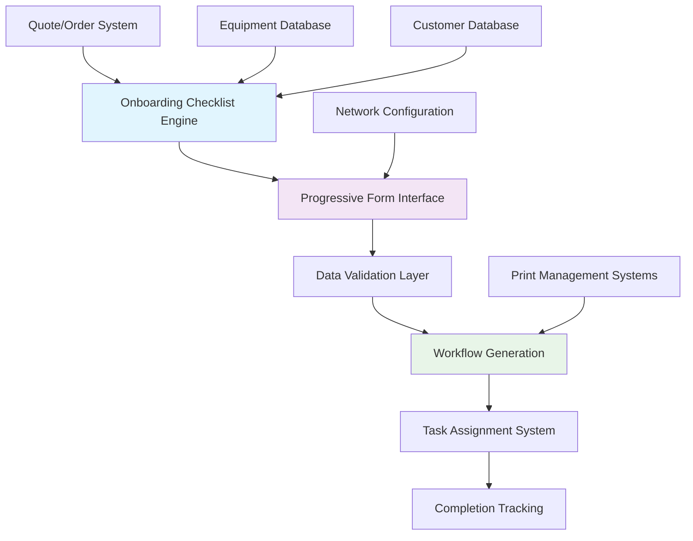
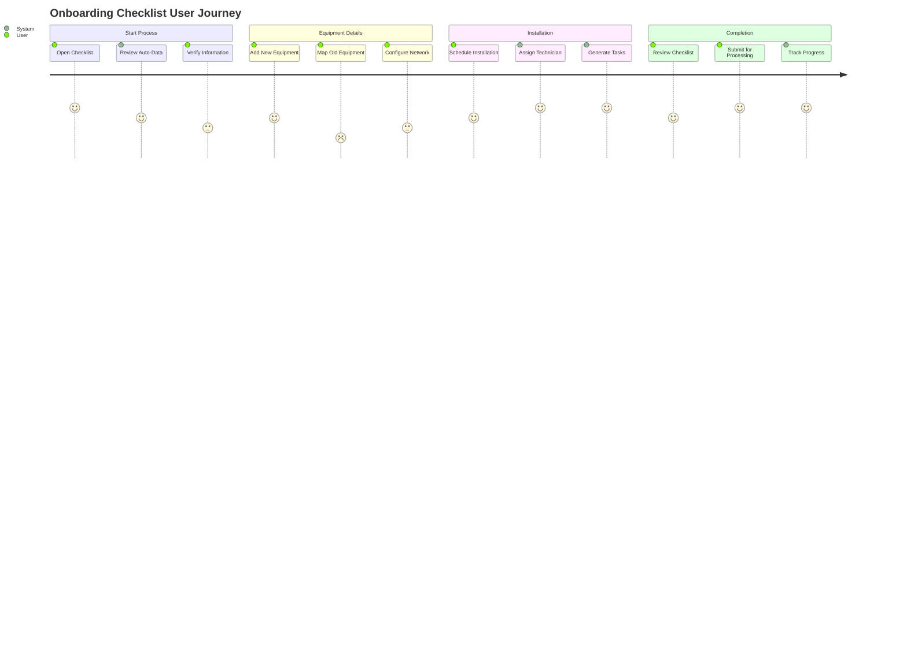

# Comprehensive Digital Onboarding Checklist System

## Complete Requirements & Implementation Guide

### Table of Contents

1. [Executive Summary](#executive-summary)
2. [System Architecture](#system-architecture)
3. [User Experience Design](#user-experience-design)
4. [Data Collection Framework](#data-collection-framework)
5. [Machine Replacement & Network Integration](#machine-replacement--network-integration)
6. [Auto-Population Logic](#auto-population-logic)
7. [Step-by-Step Process Flow](#step-by-step-process-flow)
8. [Technical Implementation](#technical-implementation)
9. [Integration Requirements](#integration-requirements)
10. [Quality Assurance & Validation](#quality-assurance--validation)

---

## Executive Summary

This document outlines a comprehensive digital onboarding checklist system that streamlines the customer onboarding process by intelligently auto-populating data from quotes/orders while capturing critical technical information for equipment replacement and network integration scenarios.

### Key Features

- **Smart Auto-Population**: Leverages existing quote and order data
- **Machine Replacement Tracking**: Captures old vs new device information
- **Network Integration**: Records IP addresses, hostnames, and network configuration
- **Print Management Ready**: Designed for Papercut and similar systems
- **Progressive UI**: Multi-step form with conditional logic
- **Mobile Optimized**: Field-ready for technicians and installers

---

## System Architecture

### High-Level System Flow



### Core Components

1. **Data Collection Engine**: Auto-populates from existing systems
2. **Progressive Form Interface**: Multi-step wizard with smart defaults
3. **Machine Replacement Module**: Tracks old/new device relationships
4. **Network Integration Module**: Captures IP, hostname, and network data
5. **Validation System**: Ensures data completeness and accuracy
6. **Workflow Engine**: Generates tasks and assignments
7. **Reporting Module**: Tracks progress and completion

---

## User Experience Design

### Design Principles

1. **Progressive Disclosure**: Show information in logical steps
2. **Smart Defaults**: Auto-populate everything possible
3. **Contextual Help**: Provide guidance at each step
4. **Error Prevention**: Validate data in real-time
5. **Mobile First**: Optimize for field use

### User Journey Map



---

## Data Collection Framework

### Primary Data Categories

#### 1. Customer Information (Auto-Populated)

- **Company Details**: Name, address, billing information
- **Primary Contacts**: Decision makers, technical contacts, billing contacts
- **Account Information**: Account manager, contract details, support level
- **Location Details**: Installation sites, shipping addresses

#### 2. Equipment Information (Mixed Auto/Manual)

- **From Quote/Order**: Equipment models, quantities, pricing
- **Manual Entry**: Serial numbers, MAC addresses, specific configurations
- **Replacement Mapping**: Old device to new device relationships

#### 3. Network Configuration (Manual Entry Required)

- **IP Addressing**: Static vs DHCP, IP ranges, subnet information
- **Network Infrastructure**: Switch ports, VLAN configuration, firewall rules
- **Hostname Convention**: Naming standards, DNS requirements

#### 4. Installation & Setup (Manual Entry)

- **Site Requirements**: Power, space, environmental conditions
- **Access Requirements**: Security, key cards, restricted areas
- **Timeline**: Preferred dates, business hours, downtime windows

---

## Machine Replacement & Network Integration

### Equipment Replacement Data Model

Based on your network asset tracking requirements, here's the comprehensive data structure:

```typescript
interface MachineReplacementData {
  // Network Identity
  targetIPAddress: string; // 10.36.20.51
  oldHostname: string; // CROFFICE-LASER
  newHostname: string; // CR12POD-LASER
  customerNumber: string; // WD14

  // Customer Information
  customerName: string; // WEST DES MOINES COMMUNITY SCHOOLS
  siteAddress: {
    street: string; // 1050 50TH ST
    city: string; // WEST DES MOINES
    state: string; // IA (from context)
    zipCode: string;
  };

  // Old Equipment Details
  oldEquipment: {
    make: string; // HP
    model: string; // LaserJet P401
    serialNumber: string; // CND249877
    macAddress?: string; // 786C77196385
    assetTag?: string;
    locationNotes: string; // Crossroads crlab-laser
  };

  // New Equipment Details
  newEquipment: {
    make: string; // Lexmark
    model: string; // M3350
    newDeviceId: string; // J8766
    newSerialNumber: string; // 4602439309Y2D
    newMacAddress?: string; // 786C77859065
    smtpName?: string; // @wdmcs.org
    buildingLocation: string; // Crossroads
    specificLocation: string; // croffice-laser
  };

  // Network Configuration
  networkConfig: {
    ipAssignmentType: "static" | "dhcp";
    subnetMask?: string;
    gateway?: string;
    dnsServers?: string[];
    vlanId?: number;
    switchPort?: string;
    networkSegment?: string;
  };

  // Print Management Integration
  printManagement: {
    system: "papercut" | "other" | "none";
    queueName?: string;
    costCenter?: string;
    userGroups?: string[];
    printQuotas?: any;
    restrictions?: any;
  };

  // Installation Details
  installation: {
    installationType: "replacement" | "new" | "relocation";
    scheduledDate?: Date;
    technicianAssigned?: string;
    specialInstructions?: string;
    accessRequirements?: string;
    businessHours?: {
      start: string;
      end: string;
      timeZone: string;
    };
  };
}
```

### Network Asset Tracking Schema

```typescript
interface NetworkAssetRecord {
  // Primary Identifiers
  id: string;
  targetIP: string;
  hostname: string;
  customerCode: string;

  // Physical Location
  location: {
    building: string;
    room: string;
    description: string;
    coordinates?: {
      lat: number;
      lng: number;
    };
  };

  // Device Lifecycle
  lifecycle: {
    status:
      | "ordered"
      | "received"
      | "staged"
      | "installed"
      | "active"
      | "replaced"
      | "retired";
    installDate?: Date;
    replacementDate?: Date;
    retirementDate?: Date;
    warrantyExpiration?: Date;
  };

  // Replacement Chain
  replacementChain: {
    replacedDeviceId?: string;
    replacementDeviceId?: string;
    replacementReason?: string;
    migrationNotes?: string;
  };
}
```

---

## Auto-Population Logic

### Data Source Mapping

#### From Quote/Proposal System

```typescript
const autoPopulateFromQuote = (quoteId: string) => {
  return {
    customerInfo: {
      companyName: quote.businessRecord.companyName,
      primaryContact: quote.contact.firstName + " " + quote.contact.lastName,
      phone: quote.contact.phone,
      email: quote.contact.email,
      billingAddress: quote.businessRecord.address,
      accountManager: quote.createdBy,
    },

    equipmentDetails: {
      items: quote.lineItems.map((item) => ({
        manufacturer: item.productName.split(" ")[0],
        model: item.productName,
        quantity: item.quantity,
        unitPrice: item.unitPrice,
        totalPrice: item.totalPrice,
        productCode: item.productCode,
        description: item.description,
      })),
      totalValue: quote.totalAmount,
      contractTerms: quote.paymentTerms,
      deliveryDate: quote.requestedDeliveryDate,
    },

    installation: {
      deliveryAddress: quote.deliveryAddress || quote.businessRecord.address,
      specialInstructions: quote.specialInstructions,
      contactPerson: quote.siteContact,
      estimatedInstallDate: calculateInstallDate(quote.deliveryDate),
    },
  };
};
```

#### From Order Management System

```typescript
const autoPopulateFromOrder = (orderId: string) => {
  return {
    equipmentDetails: {
      serialNumbers: order.items.map((item) => item.serialNumber),
      trackingNumbers: order.shipmentTracking,
      actualDeliveryDate: order.deliveredDate,
      receivedCondition: order.receivingNotes,
    },

    installation: {
      actualDeliveryDate: order.deliveredDate,
      installationWindow: order.scheduledInstallDate,
      technicianAssigned: order.assignedTechnician,
    },
  };
};
```

---

## Step-by-Step Process Flow

### Phase 1: Initial Setup & Data Validation

#### Step 1: Customer Information Verification

**Auto-Populated Fields:**

- Company name and billing address
- Primary contact information
- Account manager assignment
- Contract details and service level

**User Actions Required:**

- Verify customer information accuracy
- Add/update site-specific contacts
- Confirm installation address if different from billing
- Add special access requirements or restrictions

**Validation Rules:**

- All contact information must be complete
- Installation address must be validated
- Emergency contact required for after-hours installations

#### Step 2: Equipment Inventory & Mapping

**Auto-Populated Fields:**

- Equipment list from quote/order
- Model numbers and quantities
- Pricing and contract terms
- Estimated delivery dates

**User Actions Required:**

- Add serial numbers when equipment arrives
- Map MAC addresses for network devices
- Identify equipment being replaced
- Note any damaged or missing items

**Special Handling for Replacements:**

```typescript
interface ReplacementMapping {
  oldDevice: {
    currentIP: string;
    currentHostname: string;
    currentLocation: string;
    make: string;
    model: string;
    serialNumber: string;
    macAddress?: string;
    removalDate: Date;
  };

  newDevice: {
    targetIP: string; // May be same as old or different
    newHostname: string; // Following customer naming convention
    newLocation: string; // May be different location
    make: string;
    model: string;
    serialNumber: string;
    macAddress?: string;
    installDate: Date;
  };

  migrationPlan: {
    networkConfigTransfer: boolean;
    printQueueMigration: boolean;
    userDataMigration: boolean;
    settingsBackup: boolean;
    downtimeWindow: {
      start: Date;
      end: Date;
      businessImpact: "low" | "medium" | "high";
    };
  };
}
```

### Phase 2: Network Configuration & Integration

#### Step 3: Network Planning

**Critical Information to Collect:**

1. **IP Address Management**

   ```typescript
   interface IPConfiguration {
     assignmentType: "static" | "dhcp" | "reserved";
     ipAddress: string; // Target IP for new device
     subnetMask: string; // Network subnet
     gateway: string; // Default gateway
     dnsServers: string[]; // DNS configuration
     alternateIPs?: string[]; // Additional IPs if needed
   }
   ```

2. **Hostname & DNS Configuration**

   ```typescript
   interface HostnameConfig {
     hostname: string; // Following customer convention
     domainName: string; // Customer domain
     dnsUpdate: boolean; // Update DNS records
     hostsFileEntry: boolean; // Local hosts file update
     namingConvention: string; // Customer's standard
   }
   ```

3. **Network Infrastructure**
   ```typescript
   interface NetworkInfrastructure {
     switchLocation: string; // Physical switch location
     switchPort: string; // Specific port number
     vlanId?: number; // VLAN assignment
     trunkingRequired: boolean; // Trunk port configuration
     firewallRules?: string[]; // Required firewall rules
     qosSettings?: any; // Quality of Service settings
   }
   ```

#### Step 4: Print Management Integration

**For Papercut and Similar Systems:**

```typescript
interface PrintManagementConfig {
  system: {
    type: "papercut" | "equitrac" | "ysoft" | "other";
    version: string;
    serverAddress: string;
    authenticationType: "ldap" | "local" | "sso";
  };

  deviceConfiguration: {
    queueName: string; // Print queue identifier
    costCenter: string; // Billing/cost center
    location: string; // Physical location code
    deviceType: "printer" | "mfp" | "copier";
    capabilities: string[]; // print, scan, fax, etc.
  };

  userAccess: {
    userGroups: string[]; // Authorized user groups
    printQuotas: {
      dailyLimit?: number;
      monthlyLimit?: number;
      costPerPage?: number;
    };
    restrictions: {
      colorPrinting: boolean;
      duplexOnly: boolean;
      timeRestrictions?: string;
    };
  };

  accountCodes: {
    required: boolean;
    validCodes: string[];
    defaultCode?: string;
  };
}
```

### Phase 3: Installation Planning & Scheduling

#### Step 5: Site Preparation & Scheduling

**Installation Requirements:**

- Power requirements and outlet locations
- Network connectivity and cable runs
- Physical space and accessibility
- Environmental conditions (temperature, humidity)
- Security requirements and access procedures

**Scheduling Coordination:**

- Customer availability windows
- Technician assignment and skills matching
- Equipment delivery coordination
- Downtime minimization planning

#### Step 6: Documentation & Handoff

**Generated Documentation:**

- Installation work order with all technical details
- Network configuration checklist
- Print management setup instructions
- Customer training schedule
- Warranty and support information

---

## Technical Implementation

### Database Schema Extensions

#### Equipment Lifecycle Table

```sql
CREATE TABLE equipment_lifecycle (
    id UUID PRIMARY KEY DEFAULT gen_random_uuid(),
    tenant_id VARCHAR NOT NULL,
    customer_id VARCHAR NOT NULL,

    -- Equipment Identity
    equipment_id VARCHAR NOT NULL,
    serial_number VARCHAR(100),
    mac_address VARCHAR(17),
    asset_tag VARCHAR(50),

    -- Network Configuration
    target_ip_address INET,
    hostname VARCHAR(255),
    domain_name VARCHAR(255),
    network_config JSONB,

    -- Location Information
    site_address JSONB,
    building VARCHAR(100),
    room_location VARCHAR(100),
    location_notes TEXT,

    -- Replacement Tracking
    replaced_equipment_id VARCHAR,
    replacement_reason VARCHAR(255),
    migration_plan JSONB,

    -- Installation Details
    installation_date TIMESTAMP,
    technician_id VARCHAR,
    installation_notes TEXT,

    -- Print Management
    print_management_config JSONB,

    -- Status Tracking
    status VARCHAR NOT NULL DEFAULT 'planned',
    created_at TIMESTAMP DEFAULT NOW(),
    updated_at TIMESTAMP DEFAULT NOW()
);
```

#### Network Asset Registry

```sql
CREATE TABLE network_asset_registry (
    id UUID PRIMARY KEY DEFAULT gen_random_uuid(),
    tenant_id VARCHAR NOT NULL,

    -- Network Identity
    ip_address INET NOT NULL,
    hostname VARCHAR(255),
    mac_address VARCHAR(17),

    -- Device Information
    device_type VARCHAR(50),
    manufacturer VARCHAR(100),
    model VARCHAR(100),
    serial_number VARCHAR(100),

    -- Customer & Location
    customer_id VARCHAR NOT NULL,
    customer_code VARCHAR(20),
    site_location JSONB,

    -- Lifecycle Status
    status VARCHAR(20) DEFAULT 'active',
    install_date TIMESTAMP,
    replacement_date TIMESTAMP,
    retirement_date TIMESTAMP,

    -- Historical Tracking
    replaced_by VARCHAR,
    replacement_for VARCHAR,

    created_at TIMESTAMP DEFAULT NOW(),
    updated_at TIMESTAMP DEFAULT NOW()
);
```

### API Endpoints

#### Onboarding Checklist API

```typescript
// Get checklist data with auto-population
GET /api/onboarding/checklist/:quoteId
Response: {
  checklistId: string;
  autoPopulatedData: OnboardingChecklistData;
  requiredFields: string[];
  optionalFields: string[];
}

// Update checklist data
PUT /api/onboarding/checklist/:checklistId
Body: Partial<OnboardingChecklistData>
Response: {
  success: boolean;
  validationErrors?: ValidationError[];
  nextStep?: string;
}

// Submit completed checklist
POST /api/onboarding/checklist/:checklistId/submit
Response: {
  workflowId: string;
  taskIds: string[];
  timeline: InstallationTimeline;
}
```

#### Network Asset Management API

```typescript
// Register new network asset
POST /api/network/assets
Body: NetworkAssetRecord
Response: { assetId: string; conflicts?: IPConflict[] }

// Update asset information
PUT /api/network/assets/:assetId
Body: Partial<NetworkAssetRecord>

// Check IP conflicts
GET /api/network/ip-check/:ipAddress
Response: { available: boolean; conflictsWith?: AssetRecord }

// Get replacement history
GET /api/network/assets/:assetId/replacement-history
Response: { replacementChain: AssetRecord[] }
```

---

## Integration Requirements

### Print Management System Integration

#### Papercut Integration

```typescript
class PapercutIntegration {
  async setupDevice(config: PrintManagementConfig) {
    // Create device in Papercut
    const device = await this.papercutAPI.createDevice({
      name: config.deviceConfiguration.queueName,
      location: config.deviceConfiguration.location,
      type: config.deviceConfiguration.deviceType,
    });

    // Configure user access
    await this.papercutAPI.setDeviceAccess(device.id, {
      userGroups: config.userAccess.userGroups,
      quotas: config.userAccess.printQuotas,
      restrictions: config.userAccess.restrictions,
    });

    // Setup account codes if required
    if (config.accountCodes.required) {
      await this.papercutAPI.setAccountCodes(device.id, {
        codes: config.accountCodes.validCodes,
        defaultCode: config.accountCodes.defaultCode,
      });
    }

    return device;
  }

  async migrateDevice(
    oldDeviceId: string,
    newDeviceConfig: PrintManagementConfig
  ) {
    // Get current device settings
    const oldDevice = await this.papercutAPI.getDevice(oldDeviceId);

    // Create new device with migrated settings
    const newDevice = await this.setupDevice({
      ...newDeviceConfig,
      userAccess: oldDevice.userAccess,
      accountCodes: oldDevice.accountCodes,
    });

    // Transfer usage history if needed
    await this.papercutAPI.transferUsageHistory(oldDeviceId, newDevice.id);

    // Deactivate old device
    await this.papercutAPI.deactivateDevice(oldDeviceId);

    return newDevice;
  }
}
```

### Network Management Integration

#### IP Address Management

```typescript
class IPAddressManager {
  async validateIPAssignment(
    ipAddress: string,
    customerId: string
  ): Promise<ValidationResult> {
    // Check for conflicts in customer network
    const conflicts = await this.checkIPConflicts(ipAddress, customerId);

    // Validate against customer's network policies
    const policyCheck = await this.validateNetworkPolicy(ipAddress, customerId);

    return {
      valid: conflicts.length === 0 && policyCheck.valid,
      conflicts,
      policyViolations: policyCheck.violations,
      recommendations: this.generateRecommendations(ipAddress, customerId),
    };
  }

  async reserveIPAddress(
    ipAddress: string,
    deviceId: string,
    customerId: string
  ) {
    // Create reservation record
    await this.networkDB.createReservation({
      ipAddress,
      deviceId,
      customerId,
      reservedAt: new Date(),
      status: "reserved",
    });

    // Update DHCP server if applicable
    if (await this.isDHCPManaged(ipAddress)) {
      await this.dhcpManager.createReservation(ipAddress, deviceId);
    }
  }
}
```

---

## Quality Assurance & Validation

### Data Validation Framework

#### Real-Time Validation Rules

```typescript
interface ValidationRules {
  customerInfo: {
    required: ['companyName', 'primaryContact', 'phone', 'email'];
    format: {
      email: /^[^\s@]+@[^\s@]+\.[^\s@]+$/;
      phone: /^\+?[\d\s\-\(\)]{10,}$/;
    };
  };

  networkConfig: {
    required: ['ipAddress', 'hostname'];
    validation: {
      ipAddress: (ip: string) => isValidIP(ip) && !isReservedIP(ip);
      hostname: (name: string) => /^[a-zA-Z0-9\-]{1,63}$/.test(name);
      macAddress: (mac: string) => /^([0-9A-Fa-f]{2}[:-]){5}([0-9A-Fa-f]{2})$/.test(mac);
    };
  };

  equipmentInfo: {
    required: ['manufacturer', 'model', 'serialNumber'];
    validation: {
      serialNumber: (sn: string) => sn.length >= 6 && /^[A-Z0-9]+$/.test(sn);
    };
  };
}
```

#### Completion Verification

```typescript
class ChecklistValidator {
  validateCompleteness(checklist: OnboardingChecklistData): ValidationReport {
    const errors: ValidationError[] = [];
    const warnings: ValidationWarning[] = [];

    // Check required fields
    this.validateRequiredFields(checklist, errors);

    // Check data consistency
    this.validateDataConsistency(checklist, errors);

    // Check for potential issues
    this.checkPotentialIssues(checklist, warnings);

    return {
      isComplete: errors.length === 0,
      errors,
      warnings,
      completionPercentage: this.calculateCompletion(checklist),
    };
  }

  private validateRequiredFields(
    checklist: OnboardingChecklistData,
    errors: ValidationError[]
  ) {
    // Validate customer information
    if (!checklist.customerInfo.companyName) {
      errors.push({
        field: "customerInfo.companyName",
        message: "Company name is required",
      });
    }

    // Validate equipment information
    checklist.equipmentDetails.items.forEach((item, index) => {
      if (!item.serialNumber) {
        errors.push({
          field: `equipmentDetails.items[${index}].serialNumber`,
          message: "Serial number is required for all equipment",
        });
      }
    });

    // Validate network configuration for network devices
    checklist.equipmentDetails.items
      .filter((item) => this.isNetworkDevice(item))
      .forEach((item, index) => {
        if (!item.networkConfig?.ipAddress) {
          errors.push({
            field: `equipmentDetails.items[${index}].networkConfig.ipAddress`,
            message: "IP address is required for network devices",
          });
        }
      });
  }
}
```

### Testing & Quality Control

#### Pre-Implementation Checklist

- [ ] All auto-population logic tested with sample data
- [ ] Form validation working for all field types
- [ ] Mobile responsiveness verified on tablets and phones
- [ ] Network conflict detection tested
- [ ] Print management integration verified
- [ ] Error handling and recovery tested
- [ ] Performance testing with large equipment lists
- [ ] Security testing for data protection
- [ ] Integration testing with existing systems
- [ ] User acceptance testing completed

#### Deployment Strategy

1. **Phase 1**: Deploy with auto-population from quotes/orders
2. **Phase 2**: Add network configuration and IP management
3. **Phase 3**: Integrate print management systems
4. **Phase 4**: Add advanced reporting and analytics
5. **Phase 5**: Mobile optimization and offline capability

---

## Success Metrics & KPIs

### Process Efficiency Metrics

- **Form Completion Time**: Target < 15 minutes for standard installations
- **Data Accuracy Rate**: Target > 98% accuracy in auto-populated fields
- **Error Reduction**: Target 75% reduction in installation errors
- **Time to First Use**: Target 50% reduction in equipment deployment time

### User Experience Metrics

- **User Satisfaction Score**: Target > 4.5/5.0
- **Form Abandonment Rate**: Target < 5%
- **Support Ticket Reduction**: Target 60% reduction in setup-related tickets
- **Training Time**: Target < 30 minutes for new users

### Technical Performance Metrics

- **System Uptime**: Target 99.9% availability
- **Response Time**: Target < 2 seconds for form interactions
- **Data Sync Accuracy**: Target 100% sync with source systems
- **Mobile Performance**: Target < 3 seconds load time on mobile devices

---

## Conclusion

This comprehensive onboarding checklist system will transform your customer onboarding process by:

1. **Eliminating Data Re-entry**: Smart auto-population from existing systems
2. **Ensuring Accuracy**: Real-time validation and conflict detection
3. **Streamlining Complex Replacements**: Proper tracking of old vs new equipment
4. **Supporting Print Management**: Ready integration with Papercut and similar systems
5. **Improving User Experience**: Progressive, mobile-optimized interface
6. **Enabling Workflow Automation**: Seamless integration with existing workflow engine

The system is designed to be implemented incrementally, allowing you to realize benefits quickly while building toward the full feature set. The focus on mobile optimization and offline capability ensures field technicians can complete checklists efficiently, even in challenging network environments.

By capturing all the critical technical details upfront, this system will significantly reduce installation errors, improve customer satisfaction, and create a comprehensive audit trail for compliance and support purposes.
