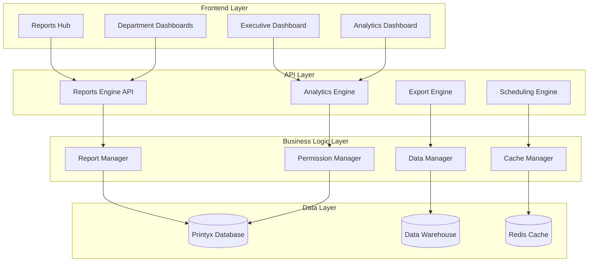

# Comprehensive Multi-Department Reporting Architecture
*Building upon existing Printyx RBAC and hierarchy systems*

## Executive Summary

This document provides an A-Z implementation guide for building comprehensive reporting across all departments (Sales, Service, Finance, Operations, HR, IT, Compliance) leveraging your existing hierarchical RBAC system and multi-location architecture.

## Table of Contents

1. [Current System Analysis](#current-system-analysis)
2. [Unified Reporting Architecture](#unified-reporting-architecture)
3. [Department-Specific Requirements](#department-specific-requirements)
4. [Technical Implementation Strategy](#technical-implementation-strategy)
5. [Database Schema Extensions](#database-schema-extensions)
6. [API Design & Endpoints](#api-design--endpoints)
7. [Frontend Architecture](#frontend-architecture)
8. [Security & Access Control](#security--access-control)
9. [Performance & Scalability](#performance--scalability)
10. [Implementation Phases](#implementation-phases)
11. [Testing & Quality Assurance](#testing--quality-assurance)
12. [Deployment & Migration](#deployment--migration)

---

## Current System Analysis

### ✅ Existing Strengths
- **Hierarchical RBAC**: 8-level role hierarchy (Platform → Company → Regional → Location)
- **Multi-Location Support**: Comprehensive location/region management
- **Tenant Isolation**: Full multi-tenant architecture with proper data segregation
- **Role-Based Permissions**: Granular permission system with department scoping
- **Organizational Structure**: Nested set model for efficient hierarchy queries
- **Basic Reporting Framework**: ReportsHub with role-based access control

### 🔧 Areas to Extend
- **Unified Reporting Engine**: Single API for all departments
- **Cross-Department Analytics**: Executive dashboards spanning multiple departments
- **Advanced Drill-Down**: Deep hierarchy navigation in reports
- **Scheduled Reporting**: Automated report generation and distribution
- **Real-Time Dashboards**: Live KPI monitoring with alerts
- **Export & Sharing**: Comprehensive export capabilities

---

## Unified Reporting Architecture

### Core Design Principles

1. **Single Source of Truth**: One reporting engine serving all departments
2. **Hierarchical Data Access**: Automatic filtering based on user's organizational position
3. **Role-Based Content**: Dynamic report content based on user permissions
4. **Consistent UX**: Unified interface across all department reports
5. **Scalable Performance**: Efficient queries supporting 1000+ users across multiple locations

### Architecture Overview



---

## Department-Specific Requirements

### 1. Sales Department

#### Key Stakeholders & Hierarchy
- **VP Sales** (Level 6): Company-wide sales strategy and performance
- **Regional Sales Director** (Level 5): Multi-location sales coordination
- **Sales Manager** (Level 4): Location-specific team management
- **Sales Supervisor** (Level 3): Team lead oversight
- **Senior Sales Rep** (Level 2): Mentoring and key accounts
- **Sales Rep** (Level 1): Individual performance and activities

#### Critical Reports & KPIs

**Pipeline Management**
```javascript
SALES_REPORTS = {
  pipeline_overview: {
    metrics: ['total_pipeline_value', 'weighted_pipeline', 'conversion_rates'],
    dimensions: ['stage', 'rep', 'location', 'time_period'],
    drill_paths: ['pipeline → stage → rep → opportunity → activities'],
    permissions: {
      'sales_rep': 'own_pipeline',
      'sales_supervisor': 'team_pipeline', 
      'sales_manager': 'location_pipeline',
      'regional_sales_director': 'regional_pipeline',
      'vp_sales': 'company_pipeline'
    }
  },
  
  territory_performance: {
    metrics: ['revenue_per_territory', 'market_penetration', 'customer_acquisition'],
    geo_mapping: true,
    heat_maps: ['performance', 'activity', 'potential'],
    comparisons: ['territory_vs_territory', 'period_over_period']
  },
  
  forecast_accuracy: {
    metrics: ['forecast_vs_actual', 'variance_analysis', 'prediction_confidence'],
    time_horizons: ['weekly', 'monthly', 'quarterly'],
    accuracy_trends: true
  },
  
  rep_productivity: {
    metrics: ['activities_per_outcome', 'call_to_meeting_ratio', 'demo_to_close'],
    coaching_insights: true,
    performance_rankings: true,
    goal_attainment: true
  }
}
```

**Quote & Proposal Analytics**
- Quote-to-close conversion rates by rep/manager/location
- Discount impact analysis and margin protection
- Proposal aging and acceptance timeframes
- Competitive win/loss analysis

### 2. Service Department

#### Key Stakeholders & Hierarchy
- **VP Service** (Level 6): Company-wide service operations
- **Regional Service Manager** (Level 5): Multi-location coordination
- **Service Manager** (Level 4): Location operations and team management
- **Service Supervisor** (Level 3): Technician team oversight
- **Senior Technician** (Level 2): Lead technical work and mentoring
- **Field Technician** (Level 1): Individual service activities

#### Critical Reports & KPIs

**Service Level Agreement (SLA) Performance**
```javascript
SERVICE_REPORTS = {
  sla_performance: {
    metrics: ['response_time', 'resolution_time', 'breach_rate', 'escalation_rate'],
    dimensions: ['priority', 'ticket_type', 'technician', 'location', 'customer'],
    real_time_monitoring: true,
    alert_thresholds: {
      'response_time_breach': '< 95%',
      'resolution_backlog': '> 24 hours',
      'technician_utilization': '< 70%'
    }
  },
  
  technician_productivity: {
    metrics: ['tickets_per_day', 'billable_hours', 'travel_efficiency', 'first_time_fix'],
    mobile_integration: true,
    gps_tracking: true,
    photo_documentation: true
  },
  
  preventive_maintenance: {
    metrics: ['pm_compliance', 'overdue_maintenance', 'equipment_health'],
    scheduling_optimization: true,
    cost_avoidance_analysis: true
  },
  
  parts_management: {
    metrics: ['parts_usage', 'inventory_turns', 'cost_recovery', 'stockouts'],
    supplier_performance: true,
    demand_forecasting: true
  }
}
```

### 3. Finance Department

#### Key Stakeholders & Hierarchy
- **CFO** (Level 7): Company-wide financial strategy
- **VP Finance** (Level 6): Financial operations oversight
- **Corporate Controller** (Level 6): Accounting and compliance
- **Regional Finance Manager** (Level 5): Multi-location financial coordination
- **Finance Manager** (Level 4): Location financial operations
- **Accounting Supervisor** (Level 3): Team oversight
- **Accounting Clerk** (Level 1): Transaction processing

#### Critical Reports & KPIs

**Accounts Receivable & Collections**
```javascript
FINANCE_REPORTS = {
  ar_aging_analysis: {
    metrics: ['dso', 'aging_buckets', 'collection_effectiveness', 'bad_debt_rate'],
    dimensions: ['customer', 'location', 'payment_terms', 'collector'],
    risk_scoring: true,
    automated_workflows: ['dunning_letters', 'collection_calls', 'legal_referrals']
  },
  
  cash_flow_management: {
    metrics: ['operating_cash_flow', 'days_cash_on_hand', 'cash_conversion_cycle'],
    forecasting: ['13_week_rolling', 'monthly_projections'],
    scenario_analysis: ['best_case', 'worst_case', 'most_likely']
  },
  
  profitability_analysis: {
    metrics: ['gross_margin', 'contribution_margin', 'ebitda', 'net_margin'],
    dimensions: ['customer', 'contract', 'location', 'service_line'],
    variance_analysis: true,
    budget_vs_actual: true
  },
  
  commission_management: {
    metrics: ['commission_expense', 'payout_timing', 'dispute_tracking'],
    plan_effectiveness: true,
    rep_rankings: true,
    audit_trails: true
  }
}
```

### 4. Operations Department

#### Key Stakeholders & Hierarchy
- **COO** (Level 7): Company-wide operations strategy
- **Operations Director** (Level 6): Cross-functional operations
- **Regional Operations Manager** (Level 5): Regional coordination
- **Location Manager** (Level 5): Site operations oversight
- **Department Manager** (Level 4): Functional area management
- **Supervisor** (Level 3): Team oversight

#### Critical Reports & KPIs

**Operational Efficiency**
```javascript
OPERATIONS_REPORTS = {
  location_performance: {
    metrics: ['revenue_per_employee', 'cost_per_transaction', 'efficiency_ratios'],
    benchmarking: ['location_vs_location', 'industry_standards'],
    trend_analysis: true
  },
  
  inventory_management: {
    metrics: ['inventory_turns', 'carrying_costs', 'obsolescence_rate'],
    abc_analysis: true,
    reorder_optimization: true,
    supplier_performance: true
  },
  
  process_optimization: {
    metrics: ['cycle_times', 'error_rates', 'rework_costs'],
    lean_metrics: ['waste_reduction', 'value_stream_efficiency'],
    six_sigma_analytics: true
  }
}
```

### 5. Human Resources Department

#### Key Stakeholders & Hierarchy
- **HR Director** (Level 6): Company-wide HR strategy
- **Regional HR Manager** (Level 5): Regional HR coordination
- **Location HR Coordinator** (Level 4): Site-specific HR support

#### Critical Reports & KPIs

**Workforce Analytics**
```javascript
HR_REPORTS = {
  talent_management: {
    metrics: ['turnover_rate', 'time_to_fill', 'retention_by_manager'],
    demographics: ['diversity', 'age_distribution', 'tenure_analysis'],
    performance_correlation: true
  },
  
  compensation_analysis: {
    metrics: ['pay_equity', 'market_positioning', 'total_rewards'],
    benchmarking: true,
    budget_planning: true
  },
  
  training_effectiveness: {
    metrics: ['training_hours', 'certification_rates', 'skill_assessments'],
    roi_analysis: true,
    performance_impact: true
  }
}
```

### 6. IT Department

#### Key Stakeholders & Hierarchy
- **IT Director** (Level 6): Technology strategy
- **Location IT Specialist** (Level 4): Site technical support

#### Critical Reports & KPIs

**Technology Performance**
```javascript
IT_REPORTS = {
  system_performance: {
    metrics: ['uptime', 'response_times', 'user_satisfaction'],
    incident_tracking: true,
    capacity_planning: true
  },
  
  security_monitoring: {
    metrics: ['security_incidents', 'compliance_status', 'vulnerability_scores'],
    threat_analysis: true,
    audit_readiness: true
  }
}
```

### 7. Compliance Department

#### Key Stakeholders & Hierarchy
- **Compliance Officer** (Level 6): Company-wide compliance oversight
- **Regional QA Manager** (Level 5): Regional quality assurance

#### Critical Reports & KPIs

**Compliance Monitoring**
```javascript
COMPLIANCE_REPORTS = {
  regulatory_compliance: {
    metrics: ['audit_scores', 'violation_rates', 'corrective_actions'],
    regulatory_tracking: true,
    risk_assessments: true
  },
  
  quality_management: {
    metrics: ['defect_rates', 'customer_satisfaction', 'process_compliance'],
    iso_certification: true,
    continuous_improvement: true
  }
}
```

---

## Technical Implementation Strategy

### 1. Database Schema Extensions

#### Core Reporting Tables

```sql
-- Reports Metadata and Configuration
CREATE TABLE report_definitions (
    id VARCHAR PRIMARY KEY DEFAULT gen_random_uuid(),
    tenant_id VARCHAR NOT NULL,
    
    -- Report Identification
    name VARCHAR(255) NOT NULL,
    code VARCHAR(100) NOT NULL, -- e.g., 'sales_pipeline', 'service_sla'
    description TEXT,
    category VARCHAR(50) NOT NULL, -- 'sales', 'service', 'finance', etc.
    
    -- Report Configuration
    sql_query TEXT NOT NULL, -- Parameterized SQL query
    default_parameters JSONB DEFAULT '{}',
    available_filters JSONB DEFAULT '{}',
    available_groupings JSONB DEFAULT '{}',
    
    -- Access Control
    required_permissions JSONB NOT NULL, -- Array of required permissions
    organizational_scope VARCHAR(20) NOT NULL, -- 'location', 'regional', 'company', 'platform'
    
    -- Display Configuration
    default_visualization VARCHAR(50) DEFAULT 'table', -- 'table', 'chart', 'dashboard'
    chart_config JSONB DEFAULT '{}',
    
    -- Performance Settings
    cache_duration INTEGER DEFAULT 300, -- Cache duration in seconds
    query_timeout INTEGER DEFAULT 30,
    
    -- Status and Metadata
    is_active BOOLEAN DEFAULT true,
    is_real_time BOOLEAN DEFAULT false,
    created_by VARCHAR NOT NULL,
    created_at TIMESTAMP DEFAULT NOW(),
    updated_at TIMESTAMP DEFAULT NOW()
);

-- User Report Preferences and Customizations
CREATE TABLE user_report_preferences (
    id VARCHAR PRIMARY KEY DEFAULT gen_random_uuid(),
    user_id VARCHAR NOT NULL REFERENCES users(id),
    report_definition_id VARCHAR NOT NULL REFERENCES report_definitions(id),
    
    -- Customization Settings
    custom_filters JSONB DEFAULT '{}',
    custom_groupings JSONB DEFAULT '{}',
    custom_chart_config JSONB DEFAULT '{}',
    favorite_dashboard BOOLEAN DEFAULT false,
    
    -- Access Tracking
    last_accessed TIMESTAMP,
    access_count INTEGER DEFAULT 0,
    
    created_at TIMESTAMP DEFAULT NOW(),
    updated_at TIMESTAMP DEFAULT NOW()
);

-- Scheduled Reports and Automated Distribution
CREATE TABLE report_schedules (
    id VARCHAR PRIMARY KEY DEFAULT gen_random_uuid(),
    tenant_id VARCHAR NOT NULL,
    report_definition_id VARCHAR NOT NULL REFERENCES report_definitions(id),
    
    -- Scheduling Configuration
    name VARCHAR(255) NOT NULL,
    description TEXT,
    cron_expression VARCHAR(100) NOT NULL, -- Standard cron format
    timezone VARCHAR(50) DEFAULT 'UTC',
    
    -- Report Parameters
    parameters JSONB DEFAULT '{}',
    filters JSONB DEFAULT '{}',
    
    -- Distribution Settings
    recipients JSONB NOT NULL, -- Array of email addresses and user IDs
    delivery_method VARCHAR(20) DEFAULT 'email', -- 'email', 'webhook', 'sftp'
    export_format VARCHAR(10) DEFAULT 'pdf', -- 'pdf', 'csv', 'xlsx'
    
    -- Status and Execution
    is_active BOOLEAN DEFAULT true,
    last_run TIMESTAMP,
    next_run TIMESTAMP,
    run_count INTEGER DEFAULT 0,
    last_status VARCHAR(20), -- 'success', 'failed', 'running'
    
    created_by VARCHAR NOT NULL,
    created_at TIMESTAMP DEFAULT NOW(),
    updated_at TIMESTAMP DEFAULT NOW()
);

-- Report Execution History and Audit Trail
CREATE TABLE report_executions (
    id VARCHAR PRIMARY KEY DEFAULT gen_random_uuid(),
    tenant_id VARCHAR NOT NULL,
    report_definition_id VARCHAR NOT NULL REFERENCES report_definitions(id),
    user_id VARCHAR REFERENCES users(id), -- NULL for scheduled reports
    schedule_id VARCHAR REFERENCES report_schedules(id), -- NULL for manual reports
    
    -- Execution Details
    parameters JSONB DEFAULT '{}',
    filters JSONB DEFAULT '{}',
    
    -- Performance Metrics
    execution_time_ms INTEGER,
    row_count INTEGER,
    cache_hit BOOLEAN DEFAULT false,
    
    -- Results and Export
    export_format VARCHAR(10),
    file_path VARCHAR(500), -- Path to exported file
    file_size_bytes INTEGER,
    
    -- Status and Timestamps
    status VARCHAR(20) NOT NULL, -- 'success', 'failed', 'timeout', 'cancelled'
    error_message TEXT,
    started_at TIMESTAMP NOT NULL,
    completed_at TIMESTAMP,
    
    created_at TIMESTAMP DEFAULT NOW()
);

-- Key Performance Indicators Configuration
CREATE TABLE kpi_definitions (
    id VARCHAR PRIMARY KEY DEFAULT gen_random_uuid(),
    tenant_id VARCHAR NOT NULL,
    
    -- KPI Identification
    name VARCHAR(255) NOT NULL,
    code VARCHAR(100) NOT NULL,
    description TEXT,
    category VARCHAR(50) NOT NULL, -- 'sales', 'service', 'finance', etc.
    
    -- Calculation Configuration
    calculation_sql TEXT NOT NULL,
    target_value DECIMAL(15,2),
    target_type VARCHAR(20), -- 'absolute', 'percentage', 'ratio'
    
    -- Display Configuration
    display_format VARCHAR(20) DEFAULT 'number', -- 'number', 'currency', 'percentage'
    color_scheme JSONB DEFAULT '{}', -- Color coding for performance levels
    
    -- Alert Configuration
    alert_enabled BOOLEAN DEFAULT false,
    alert_thresholds JSONB DEFAULT '{}',
    alert_recipients JSONB DEFAULT '[]',
    
    -- Access Control
    required_permissions JSONB NOT NULL,
    organizational_scope VARCHAR(20) NOT NULL,
    
    -- Status and Metadata
    is_active BOOLEAN DEFAULT true,
    refresh_frequency INTEGER DEFAULT 3600, -- Refresh frequency in seconds
    
    created_by VARCHAR NOT NULL,
    created_at TIMESTAMP DEFAULT NOW(),
    updated_at TIMESTAMP DEFAULT NOW()
);

-- KPI Values Historical Tracking
CREATE TABLE kpi_values (
    id VARCHAR PRIMARY KEY DEFAULT gen_random_uuid(),
    tenant_id VARCHAR NOT NULL,
    kpi_definition_id VARCHAR NOT NULL REFERENCES kpi_definitions(id),
    
    -- Dimensional Data
    location_id VARCHAR REFERENCES locations(id),
    region_id VARCHAR REFERENCES regions(id),
    user_id VARCHAR REFERENCES users(id), -- For user-specific KPIs
    team_id VARCHAR REFERENCES teams(id), -- For team-specific KPIs
    
    -- Time Dimensions
    date_value DATE NOT NULL,
    time_period VARCHAR(20) NOT NULL, -- 'daily', 'weekly', 'monthly', 'quarterly'
    
    -- KPI Values
    actual_value DECIMAL(15,2) NOT NULL,
    target_value DECIMAL(15,2),
    variance_value DECIMAL(15,2),
    variance_percentage DECIMAL(8,4),
    
    -- Performance Classification
    performance_level VARCHAR(20), -- 'excellent', 'good', 'warning', 'critical'
    
    -- Metadata
    calculation_timestamp TIMESTAMP DEFAULT NOW(),
    data_freshness TIMESTAMP, -- When underlying data was last updated
    
    created_at TIMESTAMP DEFAULT NOW()
);

-- Index Optimizations for Reporting Performance
CREATE INDEX idx_report_executions_tenant_date ON report_executions(tenant_id, created_at DESC);
CREATE INDEX idx_report_executions_user_date ON report_executions(user_id, created_at DESC);
CREATE INDEX idx_kpi_values_tenant_date ON kpi_values(tenant_id, date_value DESC);
CREATE INDEX idx_kpi_values_location_date ON kpi_values(location_id, date_value DESC);
CREATE INDEX idx_kpi_values_kpi_period ON kpi_values(kpi_definition_id, time_period, date_value DESC);
```

#### Enhanced User Activity Tracking

```sql
-- User Activity and Engagement Tracking for Reporting
CREATE TABLE user_report_activity (
    id VARCHAR PRIMARY KEY DEFAULT gen_random_uuid(),
    tenant_id VARCHAR NOT NULL,
    user_id VARCHAR NOT NULL REFERENCES users(id),
    
    -- Activity Details
    activity_type VARCHAR(50) NOT NULL, -- 'view_report', 'export_report', 'schedule_report', 'customize_dashboard'
    report_definition_id VARCHAR REFERENCES report_definitions(id),
    kpi_definition_id VARCHAR REFERENCES kpi_definitions(id),
    
    -- Activity Context
    session_id VARCHAR,
    ip_address INET,
    user_agent TEXT,
    
    -- Activity Data
    parameters JSONB DEFAULT '{}',
    duration_seconds INTEGER,
    
    -- Performance Tracking
    load_time_ms INTEGER,
    error_occurred BOOLEAN DEFAULT false,
    error_message TEXT,
    
    created_at TIMESTAMP DEFAULT NOW()
);

CREATE INDEX idx_user_activity_user_date ON user_report_activity(user_id, created_at DESC);
CREATE INDEX idx_user_activity_tenant_type ON user_report_activity(tenant_id, activity_type, created_at DESC);
```

### 2. API Design & Endpoints

#### Core Reports API

```typescript
// Enhanced Reports API with hierarchical access control
interface ReportsAPIEndpoints {
  // Report Management
  'GET /api/reports': {
    query: {
      category?: string; // 'sales', 'service', 'finance', etc.
      scope?: 'location' | 'regional' | 'company' | 'platform';
      search?: string;
      page?: number;
      limit?: number;
    };
    response: {
      reports: ReportDefinition[];
      total: number;
      user_permissions: string[];
      available_scopes: string[];
    };
  };
  
  'GET /api/reports/:id/data': {
    query: {
      // Time Range
      from_date?: string;
      to_date?: string;
      period?: 'daily' | 'weekly' | 'monthly' | 'quarterly';
      
      // Hierarchical Filters (automatically applied based on user permissions)
      location_ids?: string[];
      region_ids?: string[];
      user_ids?: string[];
      team_ids?: string[];
      
      // Dynamic Grouping
      group_by?: string[];
      
      // Sorting and Pagination
      sort_by?: string;
      sort_direction?: 'asc' | 'desc';
      page?: number;
      limit?: number;
      
      // Export Options
      export_format?: 'json' | 'csv' | 'xlsx' | 'pdf';
    };
    response: {
      data: any[];
      metadata: {
        total_rows: number;
        execution_time_ms: number;
        cache_hit: boolean;
        data_freshness: string;
        available_drill_downs: string[];
      };
      summary_stats?: Record<string, number>;
    };
  };
  
  // KPI Management
  'GET /api/kpis': {
    query: {
      category?: string;
      scope?: string;
      time_period?: string;
    };
    response: {
      kpis: KPIWithValues[];
      last_updated: string;
    };
  };
  
  'GET /api/kpis/:id/historical': {
    query: {
      from_date: string;
      to_date: string;
      granularity: 'daily' | 'weekly' | 'monthly';
      dimension?: 'location' | 'region' | 'user' | 'team';
    };
    response: {
      historical_data: KPIHistoricalValue[];
      trend_analysis: {
        direction: 'up' | 'down' | 'stable';
        percentage_change: number;
        confidence_level: number;
      };
    };
  };
  
  // Dashboard Management
  'GET /api/dashboards/executive': {
    response: {
      sections: DashboardSection[];
      kpis: ExecutiveKPI[];
      alerts: Alert[];
    };
  };
  
  'GET /api/dashboards/department/:department': {
    params: {
      department: 'sales' | 'service' | 'finance' | 'operations' | 'hr' | 'it' | 'compliance';
    };
    response: {
      dashboard: DepartmentDashboard;
      user_customizations: UserCustomization[];
    };
  };
  
  // Export and Scheduling
  'POST /api/reports/export': {
    body: {
      report_id: string;
      parameters: Record<string, any>;
      format: 'csv' | 'xlsx' | 'pdf';
      email_recipients?: string[];
    };
    response: {
      export_id: string;
      download_url?: string;
      estimated_completion: string;
    };
  };
  
  'POST /api/reports/schedule': {
    body: {
      report_id: string;
      name: string;
      cron_expression: string;
      parameters: Record<string, any>;
      recipients: string[];
      format: 'csv' | 'xlsx' | 'pdf';
    };
    response: {
      schedule_id: string;
      next_run: string;
    };
  };
  
  // Real-time Analytics
  'GET /api/analytics/real-time': {
    query: {
      metrics: string[];
      scope?: string;
    };
    response: {
      metrics: RealTimeMetric[];
      last_updated: string;
      refresh_interval: number;
    };
  };
  
  // Drill-down and Navigation
  'GET /api/reports/:id/drill-down': {
    query: {
      dimension: string;
      value: string;
      filters: Record<string, any>;
    };
    response: {
      drill_down_data: any[];
      available_actions: string[];
      breadcrumb: BreadcrumbItem[];
    };
  };
}
```

#### Permission-Based Query Builder

```typescript
class HierarchicalQueryBuilder {
  constructor(
    private userContext: UserContext,
    private tenantId: string
  ) {}

  buildBaseQuery(reportDefinition: ReportDefinition): string {
    let baseQuery = reportDefinition.sql_query;
    
    // Apply tenant isolation
    baseQuery = this.applyTenantFilter(baseQuery, this.tenantId);
    
    // Apply hierarchical access control
    switch (this.userContext.accessScope) {
      case 'location':
        baseQuery = this.applyLocationFilter(baseQuery, this.userContext.locationIds);
        break;
      case 'regional':
        baseQuery = this.applyRegionalFilter(baseQuery, this.userContext.regionIds);
        break;
      case 'company':
        baseQuery = this.applyCompanyFilter(baseQuery, this.tenantId);
        break;
      case 'platform':
        // Platform users can access all data (for Printyx staff)
        break;
    }
    
    // Apply department-specific filters
    if (this.userContext.departments.length > 0) {
      baseQuery = this.applyDepartmentFilter(baseQuery, this.userContext.departments);
    }
    
    return baseQuery;
  }

  private applyLocationFilter(query: string, locationIds: string[]): string {
    // Inject location filter into WHERE clause
    const locationFilter = `AND location_id IN (${locationIds.map(id => `'${id}'`).join(',')})`;
    return query.replace(/WHERE/, `WHERE 1=1 ${locationFilter} AND`);
  }

  private applyRegionalFilter(query: string, regionIds: string[]): string {
    // Inject regional filter that includes all locations in the regions
    const regionalFilter = `
      AND (
        region_id IN (${regionIds.map(id => `'${id}'`).join(',')})
        OR location_id IN (
          SELECT id FROM locations 
          WHERE region_id IN (${regionIds.map(id => `'${id}'`).join(',')})
        )
      )
    `;
    return query.replace(/WHERE/, `WHERE 1=1 ${regionalFilter} AND`);
  }

  private applyDepartmentFilter(query: string, departments: string[]): string {
    // Apply department-specific data filters
    const deptFilter = `AND department IN (${departments.map(d => `'${d}'`).join(',')})`;
    return query.replace(/WHERE/, `WHERE 1=1 ${deptFilter} AND`);
  }
}
```

### 3. Frontend Architecture

#### Component Structure

```typescript
// Enhanced Dashboard Architecture
interface DashboardArchitecture {
  // Top-level routing and navigation
  'src/pages/ReportsHub.tsx': 'Main reports landing page with role-based cards';
  'src/pages/ExecutiveDashboard.tsx': 'C-level cross-department overview';
  'src/pages/DepartmentDashboard.tsx': 'Department-specific analytics';
  
  // Department-specific pages
  'src/pages/reports/SalesDashboard.tsx': 'Sales performance and pipeline';
  'src/pages/reports/ServiceDashboard.tsx': 'Service operations and SLA';
  'src/pages/reports/FinanceDashboard.tsx': 'Financial performance and cash flow';
  'src/pages/reports/OperationsDashboard.tsx': 'Operational efficiency metrics';
  'src/pages/reports/HRDashboard.tsx': 'Workforce analytics';
  'src/pages/reports/ITDashboard.tsx': 'Technology performance';
  'src/pages/reports/ComplianceDashboard.tsx': 'Regulatory and quality metrics';
  
  // Shared components
  'src/components/reports/ReportCard.tsx': 'Reusable report display component';
  'src/components/reports/KPIWidget.tsx': 'KPI display with trends';
  'src/components/reports/ChartContainer.tsx': 'Unified chart wrapper';
  'src/components/reports/FilterPanel.tsx': 'Hierarchical filtering';
  'src/components/reports/ExportButton.tsx': 'Export functionality';
  'src/components/reports/DrillDownTable.tsx': 'Interactive data tables';
  'src/components/reports/RealTimeIndicator.tsx': 'Live data status';
  
  // Utility components
  'src/components/reports/PermissionGate.tsx': 'Role-based component rendering';
  'src/components/reports/HierarchySelector.tsx': 'Location/region selection';
  'src/components/reports/DateRangePicker.tsx': 'Time period selection';
  'src/hooks/useReportData.tsx': 'Data fetching with caching';
  'src/hooks/useHierarchicalAccess.tsx': 'Permission-based data access';
}
```

#### Advanced Dashboard Component

```tsx
// Enhanced Executive Dashboard with Cross-Department Analytics
import React, { useState, useMemo } from 'react';
import { useQuery } from '@tanstack/react-query';
import { Card, CardContent, CardHeader, CardTitle } from '@/components/ui/card';
import { Tabs, TabsContent, TabsList, TabsTrigger } from '@/components/ui/tabs';
import { KPIWidget } from '@/components/reports/KPIWidget';
import { ChartContainer } from '@/components/reports/ChartContainer';
import { HierarchySelector } from '@/components/reports/HierarchySelector';
import { useHierarchicalAccess } from '@/hooks/useHierarchicalAccess';

interface ExecutiveDashboardProps {
  userLevel: number;
  accessScope: 'location' | 'regional' | 'company' | 'platform';
}

export function ExecutiveDashboard({ userLevel, accessScope }: ExecutiveDashboardProps) {
  const [selectedTimeRange, setSelectedTimeRange] = useState('last_30_days');
  const [selectedScope, setSelectedScope] = useState(accessScope);
  
  const { accessibleLocations, accessibleRegions } = useHierarchicalAccess();
  
  // Fetch executive KPIs based on user's hierarchical access
  const { data: executiveKPIs, isLoading } = useQuery({
    queryKey: ['executive-kpis', selectedTimeRange, selectedScope],
    queryFn: () => apiRequest('/api/dashboards/executive', {
      params: { 
        time_range: selectedTimeRange,
        scope: selectedScope,
        location_ids: accessibleLocations,
        region_ids: accessibleRegions
      }
    }),
    refetchInterval: 60000 // Refresh every minute for executive dashboards
  });

  const departmentTabs = useMemo(() => {
    const baseTabs = [
      { key: 'overview', label: 'Overview', permission: 'canViewExecutiveReports' },
      { key: 'sales', label: 'Sales', permission: 'canViewSalesReports' },
      { key: 'service', label: 'Service', permission: 'canViewServiceReports' },
      { key: 'finance', label: 'Finance', permission: 'canViewFinanceReports' },
      { key: 'operations', label: 'Operations', permission: 'canViewOperationsReports' }
    ];
    
    // Add advanced tabs for higher-level users
    if (userLevel >= 6) {
      baseTabs.push(
        { key: 'hr', label: 'HR', permission: 'canViewHRReports' },
        { key: 'it', label: 'IT', permission: 'canViewITReports' },
        { key: 'compliance', label: 'Compliance', permission: 'canViewComplianceReports' }
      );
    }
    
    return baseTabs;
  }, [userLevel]);

  if (isLoading) {
    return <div className="flex items-center justify-center h-64">Loading executive dashboard...</div>;
  }

  return (
    <div className="space-y-6">
      {/* Dashboard Header with Scope Selection */}
      <div className="flex items-center justify-between">
        <div>
          <h1 className="text-3xl font-bold tracking-tight">Executive Dashboard</h1>
          <p className="text-muted-foreground">
            Company-wide performance overview across all departments
          </p>
        </div>
        
        <div className="flex items-center space-x-4">
          <HierarchySelector
            value={selectedScope}
            onChange={setSelectedScope}
            availableScopes={[accessScope]}
            userLevel={userLevel}
          />
          <DateRangePicker
            value={selectedTimeRange}
            onChange={setSelectedTimeRange}
          />
        </div>
      </div>

      {/* Key Performance Indicators Grid */}
      <div className="grid grid-cols-1 md:grid-cols-2 lg:grid-cols-4 gap-4">
        {executiveKPIs?.kpis?.map((kpi) => (
          <KPIWidget
            key={kpi.id}
            title={kpi.name}
            value={kpi.current_value}
            target={kpi.target_value}
            trend={kpi.trend}
            format={kpi.display_format}
            colorScheme={kpi.color_scheme}
            lastUpdated={kpi.last_updated}
            drillDownPath={`/reports/${kpi.category}/${kpi.code}`}
          />
        ))}
      </div>

      {/* Department-Specific Dashboards */}
      <Tabs defaultValue="overview" className="space-y-4">
        <TabsList className="grid w-full grid-cols-5 lg:grid-cols-8">
          {departmentTabs.map((tab) => (
            <PermissionGate key={tab.key} permission={tab.permission}>
              <TabsTrigger value={tab.key}>{tab.label}</TabsTrigger>
            </PermissionGate>
          ))}
        </TabsList>

        <TabsContent value="overview" className="space-y-4">
          <OverviewDashboard 
            timeRange={selectedTimeRange}
            scope={selectedScope}
            data={executiveKPIs?.overview}
          />
        </TabsContent>

        <TabsContent value="sales" className="space-y-4">
          <SalesExecutiveDashboard 
            timeRange={selectedTimeRange}
            scope={selectedScope}
            data={executiveKPIs?.sales}
          />
        </TabsContent>

        <TabsContent value="service" className="space-y-4">
          <ServiceExecutiveDashboard 
            timeRange={selectedTimeRange}
            scope={selectedScope}
            data={executiveKPIs?.service}
          />
        </TabsContent>

        <TabsContent value="finance" className="space-y-4">
          <FinanceExecutiveDashboard 
            timeRange={selectedTimeRange}
            scope={selectedScope}
            data={executiveKPIs?.finance}
          />
        </TabsContent>

        {/* Additional department tabs for senior executives */}
        {userLevel >= 6 && (
          <>
            <TabsContent value="hr" className="space-y-4">
              <HRExecutiveDashboard 
                timeRange={selectedTimeRange}
                scope={selectedScope}
                data={executiveKPIs?.hr}
              />
            </TabsContent>

            <TabsContent value="it" className="space-y-4">
              <ITExecutiveDashboard 
                timeRange={selectedTimeRange}
                scope={selectedScope}
                data={executiveKPIs?.it}
              />
            </TabsContent>

            <TabsContent value="compliance" className="space-y-4">
              <ComplianceExecutiveDashboard 
                timeRange={selectedTimeRange}
                scope={selectedScope}
                data={executiveKPIs?.compliance}
              />
            </TabsContent>
          </>
        )}
      </Tabs>

      {/* Real-time Alerts and Notifications */}
      <Card>
        <CardHeader>
          <CardTitle>Active Alerts & Notifications</CardTitle>
        </CardHeader>
        <CardContent>
          <AlertsPanel 
            alerts={executiveKPIs?.alerts}
            userLevel={userLevel}
            onDismiss={(alertId) => {/* Handle alert dismissal */}}
          />
        </CardContent>
      </Card>
    </div>
  );
}
```

---

## Security & Access Control

### 1. Multi-Level Permission System

```typescript
// Enhanced Permission Matrix for Reporting
interface ReportingPermissions {
  // Department Access
  canViewSalesReports: boolean;
  canViewServiceReports: boolean;
  canViewFinanceReports: boolean;
  canViewOperationsReports: boolean;
  canViewHRReports: boolean;
  canViewITReports: boolean;
  canViewComplianceReports: boolean;
  canViewExecutiveReports: boolean;
  
  // Data Scope Permissions
  canViewOwnData: boolean;
  canViewTeamData: boolean;
  canViewLocationData: boolean;
  canViewRegionalData: boolean;
  canViewCompanyData: boolean;
  canViewAllTenantData: boolean; // Platform users only
  
  // Action Permissions
  canExportReports: boolean;
  canScheduleReports: boolean;
  canCustomizeDashboards: boolean;
  canManageKPIs: boolean;
  canViewSensitiveFinancials: boolean;
  canAccessRealTimeData: boolean;
  
  // Administrative Permissions
  canManageReportDefinitions: boolean;
  canManageUserAccess: boolean;
  canViewAuditLogs: boolean;
  canConfigureAlerts: boolean;
}

// Permission Enforcement Middleware
class ReportingPermissionService {
  static validateReportAccess(
    user: User,
    reportDefinition: ReportDefinition,
    requestedScope: string[]
  ): ValidationResult {
    // Check basic permission for report category
    const hasBasicAccess = this.hasPermission(
      user.permissions,
      `canView${capitalize(reportDefinition.category)}Reports`
    );
    
    if (!hasBasicAccess) {
      return { allowed: false, reason: 'Insufficient department access' };
    }
    
    // Check organizational scope access
    const allowedScope = this.calculateAllowedScope(user);
    const requestedScopeValid = requestedScope.every(scope => 
      allowedScope.includes(scope)
    );
    
    if (!requestedScopeValid) {
      return { allowed: false, reason: 'Insufficient organizational scope' };
    }
    
    // Check for sensitive data access
    if (reportDefinition.containsSensitiveData && !user.permissions.canViewSensitiveFinancials) {
      return { allowed: false, reason: 'Insufficient access to sensitive data' };
    }
    
    return { allowed: true };
  }
  
  static calculateAllowedScope(user: User): string[] {
    switch (user.accessScope) {
      case 'platform':
        return ['platform', 'company', 'regional', 'location', 'team', 'individual'];
      case 'company':
        return ['company', 'regional', 'location', 'team', 'individual'];
      case 'regional':
        return ['regional', 'location', 'team', 'individual'];
      case 'location':
        return ['location', 'team', 'individual'];
      default:
        return ['individual'];
    }
  }
}
```

### 2. Data Encryption and Compliance

```typescript
// Enhanced Data Security for Reporting
interface DataSecurityConfig {
  // PII Protection
  maskPersonalData: boolean;
  encryptSensitiveFields: string[];
  redactFinancialData: boolean;
  
  // Audit Requirements
  logAllAccess: boolean;
  retainAuditLogs: number; // Days
  requireDataAccess justification: boolean;
  
  // Compliance Standards
  gdprCompliant: boolean;
  soxCompliant: boolean;
  hipaaCompliant: boolean;
}

class ReportingSecurityService {
  static applyDataMasking(
    data: any[],
    user: User,
    securityConfig: DataSecurityConfig
  ): any[] {
    return data.map(row => {
      const maskedRow = { ...row };
      
      // Apply PII masking based on user permissions
      if (!user.permissions.canViewPersonalData) {
        securityConfig.encryptSensitiveFields.forEach(field => {
          if (maskedRow[field]) {
            maskedRow[field] = this.maskValue(maskedRow[field], field);
          }
        });
      }
      
      // Apply financial data redaction
      if (!user.permissions.canViewSensitiveFinancials && securityConfig.redactFinancialData) {
        this.redactFinancialFields(maskedRow);
      }
      
      return maskedRow;
    });
  }
  
  static async logReportAccess(
    user: User,
    reportDefinition: ReportDefinition,
    parameters: Record<string, any>,
    executionTime: number
  ): Promise<void> {
    await db.insert(report_executions).values({
      tenant_id: user.tenantId,
      report_definition_id: reportDefinition.id,
      user_id: user.id,
      parameters,
      execution_time_ms: executionTime,
      status: 'success',
      started_at: new Date(),
      completed_at: new Date()
    });
  }
}
```

---

## Performance & Scalability

### 1. Caching Strategy

```typescript
// Multi-Level Caching for Reports
interface CachingStrategy {
  // L1 Cache: In-Memory (Redis)
  realTimeKPIs: {
    ttl: 60; // 1 minute
    keyPattern: 'kpi:{tenant}:{kpi_id}:{scope}';
  };
  
  // L2 Cache: Report Results
  reportResults: {
    ttl: 300; // 5 minutes for standard reports
    ttl_sensitive: 60; // 1 minute for financial reports
    keyPattern: 'report:{tenant}:{report_id}:{params_hash}';
  };
  
  // L3 Cache: Aggregated Data
  aggregatedMetrics: {
    ttl: 3600; // 1 hour
    keyPattern: 'agg:{tenant}:{metric}:{period}:{scope}';
  };
  
  // L4 Cache: Static Reference Data
  referenceData: {
    ttl: 86400; // 24 hours
    keyPattern: 'ref:{tenant}:{data_type}';
  };
}

class ReportingCacheService {
  private redis: Redis;
  
  async getCachedReport(
    tenantId: string,
    reportId: string,
    parameters: Record<string, any>
  ): Promise<CachedReport | null> {
    const cacheKey = this.generateCacheKey(tenantId, reportId, parameters);
    const cached = await this.redis.get(cacheKey);
    
    if (cached) {
      const report = JSON.parse(cached) as CachedReport;
      
      // Check if cache is still fresh
      if (Date.now() - report.cached_at < report.ttl * 1000) {
        return report;
      }
    }
    
    return null;
  }
  
  async setCachedReport(
    tenantId: string,
    reportId: string,
    parameters: Record<string, any>,
    data: any[],
    ttl: number
  ): Promise<void> {
    const cacheKey = this.generateCacheKey(tenantId, reportId, parameters);
    const cachedReport: CachedReport = {
      data,
      cached_at: Date.now(),
      ttl,
      metadata: {
        row_count: data.length,
        cache_key: cacheKey
      }
    };
    
    await this.redis.setex(cacheKey, ttl, JSON.stringify(cachedReport));
  }
  
  private generateCacheKey(
    tenantId: string,
    reportId: string,
    parameters: Record<string, any>
  ): string {
    const paramHash = crypto
      .createHash('md5')
      .update(JSON.stringify(parameters))
      .digest('hex');
    
    return `report:${tenantId}:${reportId}:${paramHash}`;
  }
}
```

### 2. Query Optimization

```sql
-- Optimized Reporting Views and Materialized Views
CREATE MATERIALIZED VIEW mv_daily_sales_metrics AS
SELECT 
    tenant_id,
    location_id,
    region_id,
    DATE(created_at) as report_date,
    
    -- Sales Metrics
    COUNT(*) as total_leads,
    COUNT(*) FILTER (WHERE status = 'qualified') as qualified_leads,
    COUNT(*) FILTER (WHERE status = 'converted') as converted_leads,
    
    -- Revenue Metrics
    SUM(estimated_value) as pipeline_value,
    SUM(estimated_value) FILTER (WHERE status = 'converted') as closed_value,
    
    -- Performance Ratios
    ROUND(
        COUNT(*) FILTER (WHERE status = 'qualified')::DECIMAL / 
        NULLIF(COUNT(*), 0) * 100, 2
    ) as qualification_rate,
    
    ROUND(
        COUNT(*) FILTER (WHERE status = 'converted')::DECIMAL / 
        NULLIF(COUNT(*) FILTER (WHERE status = 'qualified'), 0) * 100, 2
    ) as conversion_rate
    
FROM business_records 
WHERE record_type = 'lead'
GROUP BY tenant_id, location_id, region_id, DATE(created_at);

-- Refresh the materialized view daily
CREATE OR REPLACE FUNCTION refresh_daily_sales_metrics()
RETURNS void AS $$
BEGIN
    REFRESH MATERIALIZED VIEW CONCURRENTLY mv_daily_sales_metrics;
END;
$$ LANGUAGE plpgsql;

-- Schedule the refresh
SELECT cron.schedule('refresh-sales-metrics', '0 1 * * *', 'SELECT refresh_daily_sales_metrics();');

-- Performance indexes
CREATE INDEX idx_mv_sales_tenant_date ON mv_daily_sales_metrics(tenant_id, report_date DESC);
CREATE INDEX idx_mv_sales_location_date ON mv_daily_sales_metrics(location_id, report_date DESC);
CREATE INDEX idx_mv_sales_region_date ON mv_daily_sales_metrics(region_id, report_date DESC);
```

---

## Implementation Phases

### Phase 1: Foundation (Weeks 1-4)
#### ✅ Goals
- Extend existing database schema with reporting tables
- Build core API endpoints for report management
- Create permission-based query builder
- Implement basic caching strategy

#### 📋 Deliverables
- [x] **Database schema migration scripts** - ✅ COMPLETED
  - Created `shared/reporting-schema.ts` with 8 comprehensive reporting tables
  - Added 14 enums for type safety and data consistency
  - Implemented proper indexing strategy for performance
  - Integrated with existing Drizzle configuration
- [x] **Core reporting API endpoints** - ✅ COMPLETED  
  - Created `server/routes-reporting.ts` with hierarchical access control
  - Implemented `/api/reports` for report discovery and listing
  - Implemented `/api/reports/:id/data` for report execution
  - Implemented `/api/kpis` and `/api/kpis/:id/historical` for KPI management
  - Built-in audit trail and user activity tracking
- [x] **Permission middleware integration** - ✅ COMPLETED
  - Created `server/reporting-rbac-middleware.ts` with comprehensive permission system
  - Integrated with existing auth system and role hierarchy
  - Role-based permission mapping for all departments and levels
  - Hierarchical query builder for data access control
  - Enhanced user context with location/region access arrays
- [x] **Redis caching implementation** - ✅ COMPLETED  
  - Created `server/cache-service.ts` with multi-level caching architecture
  - In-memory cache for Phase 1, Redis-ready for Phase 2
  - Report-specific TTL based on data sensitivity and real-time requirements
  - Cache middleware for automatic report data caching
  - KPI-specific caching with scope-aware keys
- [x] **Basic report definitions for 3 departments** - ✅ COMPLETED
  - Created `server/routes-reporting-definitions.ts` with comprehensive report catalog
  - **Sales Reports**: Pipeline Overview, Rep Performance Analytics
  - **Service Reports**: SLA Performance Dashboard, Technician Productivity Analysis
  - **Finance Reports**: Accounts Receivable Aging Analysis
  - **KPI Definitions**: 5 core KPIs across Sales and Service departments
  - Seed function to populate tenant-specific report definitions

### Phase 2: Department Dashboards (Weeks 5-8)
#### ✅ Goals
- Build department-specific dashboard components
- Implement hierarchical data filtering
- Create export functionality
- Add real-time KPI monitoring

#### 📋 Deliverables
- [x] **Enhanced ReportsHub with new architecture** - ✅ COMPLETED
  - Created `client/src/pages/EnhancedReportsHub.tsx` with modern UI
  - Integrated with new reporting API endpoints
  - Category-based report organization with search and filtering
  - Real-time KPI overview dashboard
  - Grid and list view modes for reports
- [x] **KPI Widget Components** - ✅ COMPLETED
  - Created `client/src/components/reports/KPIWidget.tsx` with comprehensive features
  - Real-time trend analysis with confidence indicators
  - Performance level color coding (excellent, good, warning, critical)
  - Target progress bars and variance calculations
  - Responsive design with multiple size options
- [x] **Interactive Report Viewer** - ✅ COMPLETED
  - Created `client/src/components/reports/ReportViewer.tsx` with advanced features
  - Dynamic filtering with date ranges, grouping, and sorting
  - Table view with expandable rows and drill-down capabilities
  - Chart view placeholder ready for visualization library
  - Auto-refresh functionality for real-time reports
  - Export functionality integration
- [x] **Export service implementation** - ✅ COMPLETED
  - Created `server/export-service.ts` with multi-format export capabilities
  - CSV export with formatted headers and data transformation
  - Excel export with styling, auto-fit columns, and summary rows
  - PDF export with professional table formatting and pagination
  - Automatic file cleanup and download URL generation
  - Export endpoints integrated into reporting API
- [x] **Real-time data updates with WebSocket integration** - ✅ COMPLETED
  - Created `server/websocket-service.ts` for live data streaming
  - WebSocket server with authentication and permission validation
  - Channel-based subscriptions for reports and KPIs
  - Heartbeat monitoring and automatic reconnection
  - Created `client/src/hooks/useWebSocket.ts` for React integration
  - Real-time KPI and report hooks with auto-subscription
  - Connection state management and error handling

### Phase 3: Executive Integration (Weeks 9-12)
#### ✅ Goals
- Build unified executive dashboard
- Implement cross-department analytics
- Add scheduled reporting
- Create alert and notification system

#### 📋 Deliverables
- [ ] Executive dashboard with cross-department KPIs
- [ ] Scheduled report system with email delivery
- [ ] Alert configuration and management
- [ ] Advanced drill-down navigation
- [ ] Performance optimization and query tuning

### Phase 4: Advanced Features (Weeks 13-16)
#### ✅ Goals
- Add remaining departments (Operations, HR, IT, Compliance)
- Implement advanced analytics and forecasting
- Build report customization tools
- Add mobile-responsive design

#### 📋 Deliverables
- [ ] Complete department coverage
- [ ] Predictive analytics integration
- [ ] Custom report builder interface
- [ ] Mobile dashboard optimization
- [ ] Advanced security and compliance features

---

## Testing & Quality Assurance

### 1. Testing Strategy

```typescript
// Comprehensive Testing Framework for Reporting
interface TestingStrategy {
  // Unit Tests
  unitTests: {
    permissionValidation: 'Test all permission combinations';
    queryGeneration: 'Test hierarchical query building';
    dataTransformation: 'Test data masking and formatting';
    cacheOperations: 'Test cache hit/miss scenarios';
  };
  
  // Integration Tests
  integrationTests: {
    apiEndpoints: 'Test all reporting API endpoints';
    databaseQueries: 'Test query performance and accuracy';
    authenticationFlow: 'Test RBAC integration';
    exportFunctionality: 'Test report export in all formats';
  };
  
  // Performance Tests
  performanceTests: {
    loadTesting: 'Test with 1000+ concurrent users';
    queryPerformance: 'Test complex report query execution times';
    cacheEfficiency: 'Test cache hit rates and performance';
    memoryUsage: 'Test memory consumption under load';
  };
  
  // Security Tests
  securityTests: {
    accessControl: 'Test unauthorized access attempts';
    dataLeakage: 'Test data isolation between tenants';
    sqlInjection: 'Test SQL injection protection';
    sensitiveDataMasking: 'Test PII and financial data protection';
  };
}
```

### 2. Quality Metrics

```typescript
// Quality Gates for Reporting System
interface QualityMetrics {
  performance: {
    queryExecutionTime: '<2 seconds for 95% of queries';
    pageLoadTime: '<3 seconds for dashboards';
    cacheHitRate: '>80% for frequently accessed reports';
    apiResponseTime: '<500ms for KPI endpoints';
  };
  
  accuracy: {
    dataConsistency: '100% consistency between reports';
    calculationAccuracy: '100% accuracy for financial calculations';
    permissionCompliance: '100% compliance with RBAC rules';
  };
  
  usability: {
    dashboardLoadTime: '<5 seconds';
    exportCompletionTime: '<30 seconds for large reports';
    mobileResponsiveness: '100% mobile compatibility';
    accessibilityCompliance: 'WCAG 2.1 AA compliance';
  };
  
  reliability: {
    systemUptime: '>99.9% availability';
    errorRate: '<0.1% error rate for API calls';
    dataFreshness: '<5 minutes for real-time KPIs';
    backupRecovery: '<4 hours recovery time';
  };
}
```

---

## Deployment & Migration

### 1. Migration Strategy

```sql
-- Database Migration Scripts
-- Migration 001: Core Reporting Tables
CREATE MIGRATION '001_add_reporting_tables'
AS $$
  -- Add all reporting tables from schema section
  -- Include proper indexes and constraints
  -- Set up default report definitions
$$;

-- Migration 002: Enhanced Permissions
CREATE MIGRATION '002_enhance_rbac_permissions'
AS $$
  -- Add new reporting-specific permissions to roles table
  -- Update existing roles with appropriate reporting permissions
  -- Create permission mappings for existing users
$$;

-- Migration 003: Materialized Views
CREATE MIGRATION '003_create_reporting_views'
AS $$
  -- Create materialized views for performance
  -- Set up refresh schedules
  -- Add necessary indexes
$$;
```

### 2. Deployment Checklist

```yaml
# Deployment Configuration
deployment:
  pre_deployment:
    - [ ] Backup current database
    - [ ] Run migration tests on staging
    - [ ] Verify API endpoint compatibility
    - [ ] Test permission mappings
    - [ ] Validate report definitions
  
  deployment:
    - [ ] Run database migrations
    - [ ] Deploy API changes
    - [ ] Deploy frontend updates
    - [ ] Update Redis cache configuration
    - [ ] Start background job services
  
  post_deployment:
    - [ ] Verify all reports load correctly
    - [ ] Test permission enforcement
    - [ ] Validate KPI calculations
    - [ ] Check export functionality
    - [ ] Monitor performance metrics
  
  rollback_plan:
    - [ ] Database rollback scripts ready
    - [ ] Previous version deployment artifacts
    - [ ] Cache invalidation procedures
    - [ ] User notification templates
```

---

## Conclusion

This comprehensive reporting architecture builds upon your existing sophisticated RBAC and hierarchy system to provide:

1. **Unified Reporting Engine**: Single system serving all departments
2. **Hierarchical Access Control**: Automatic data filtering based on organizational position
3. **Department-Specific Analytics**: Tailored dashboards for each business function
4. **Executive Intelligence**: Cross-department insights for strategic decision making
5. **Scalable Performance**: Optimized for 1000+ users across multiple locations
6. **Enterprise Security**: Comprehensive data protection and compliance
7. **Future-Ready Architecture**: Extensible design for additional departments and features

The phased implementation approach allows for iterative delivery while maintaining system stability and user adoption. Each phase builds upon the previous foundation, ultimately delivering a comprehensive reporting solution that scales with your business growth.

Would you like me to elaborate on any specific section or begin implementing any particular component of this architecture?
