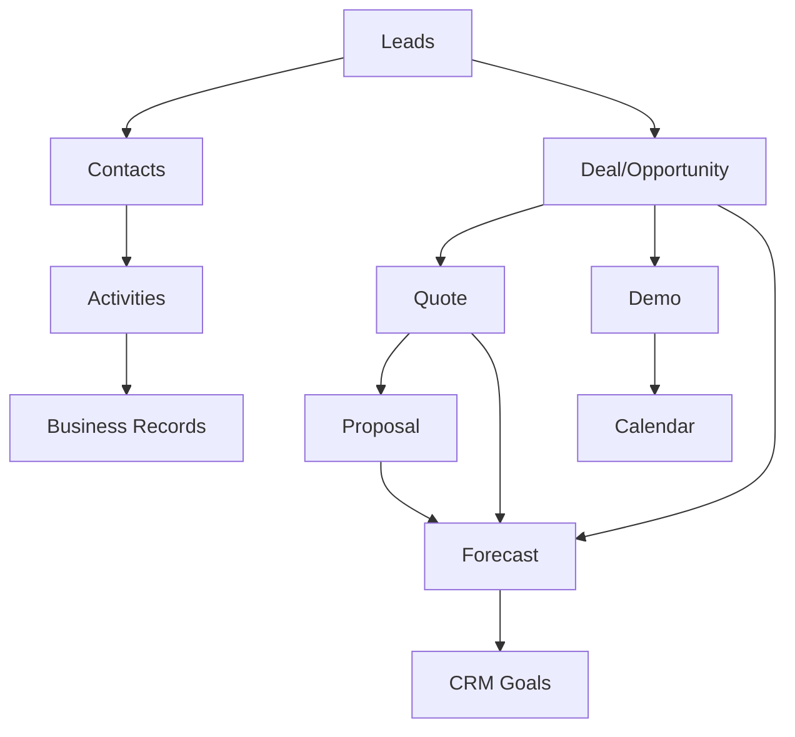

## CRM audit and Lean/Six Sigma UX flow (Printyx)

### Purpose and scope

- Provide a clear end‑to‑end CRM flow (lead → customer) aligned to Lean/Six Sigma
- Identify concrete defects, inconsistencies, and wastes; provide code‑level fixes
- Recommend a target UX with standard work, metrics, and a phased rollout plan

### Current state (as‑is) flow

Observed implementation highlights

- Leads list/detail exist and are navigable; contacts and activities are present
- Quotes and proposals exist (proposal builder, quote builder, lead‑scoped lists)
- Demo scheduling UI is present; server routes are placeholders for real calendars
- Forecasting and CRM goals endpoints and UIs exist; forecasting composes pipeline

### Issues and inconsistencies (top defects)

1. Lead detail init/update bugs

- In `client/src/pages/LeadDetail.tsx` the initialization uses `useState` instead of `useEffect`, and `apiRequest` parameter order is reversed.
- Fix:
  - Switch to `useEffect(() => { if (lead) setEditForm(lead) }, [lead])`
  - Use `apiRequest(url, method, body)` signature for PUT.

2. Lead card click (mobile cards) breaks navigation

- In `LeadsManagement.tsx` the card calls `handleLeadClick(lead.id)` but the handler expects a lead object.

3. Contacts API surface is fragmented

- `Contacts.tsx` uses `/api/company-contacts`; `ContactManager.tsx` uses `/api/companies/:companyId/contacts` and `/api/contacts/:id`.
- Recommendation: standardize to one REST surface:
  - GET/POST `/api/company-contacts`
  - GET `/api/company-contacts?companyId=...`
  - PUT/DELETE `/api/company-contacts/:id`

4. Quotes vs Proposals mismatch

- UI fetches quotes via `/api/quotes?leadId=...`, while the builder creates a “quote” via `/api/proposals` with `proposalType: 'quote'`.
- Recommendation: unify to a single resource (e.g., `/api/proposals` with `type: 'quote' | 'proposal'`) or fully separate `/api/quotes` and `/api/proposals` end‑to‑end.

5. Missing first‑class Deal/Opportunity as the central object

- Deals tab is a placeholder; quotes/proposals are attached to leads, not deals.
- Recommendation: introduce Deal entity and attach quotes/proposals/activities/demos to a deal.

6. Activities consistency gaps

- Lead activities are unified on `/api/business-records/:id/activities`, but Contacts “Log activity” is UI‑only.
- Recommendation: support optional `contactId` on the same activities endpoint and wire the Contacts UI to post.

7. Calendar integration is placeholder

- Demo scheduling server routes return sample data; no MS Graph/Google Calendar creation nor webhooks.

8. RBAC/tenancy coverage

- Ensure all CRM routes consistently apply `resolveTenant`/`requireTenant`.

### Target state (to‑be) flow and UX

Principles

- Single source of truth per object; fewer endpoints, clearer relationships
- Deals are the spine of the process; quotes/proposals/demos attach to deals
- Next‑step CTAs are visible at each stage (reduce motion/waiting)

Target UX journey

1. Lead intake
   - New lead → CTA row: “Create Deal”, “Add Contacts”, “Log Activity”, “Schedule Demo”, “Create Quote”, “Create Proposal”
   - If “Create Deal”: prefill from lead; set stage, probability, expected close
2. Deal workspace (primary console)
   - Tabs: Overview, Contacts, Activities, Quotes, Proposals, Demo, Files
   - CTA strip: Create Quote, Build Proposal, Schedule Demo, Update Stage
3. Quotes and proposals
   - Create under a deal; builder prefilled (company/contact/deal)
   - Proposal acceptance transitions deal → Won; triggers lead → customer conversion
4. Demo scheduling
   - From deal; creates external calendar event (Teams/Google) and stores eventId
5. Pipeline/forecasting & goals
   - Pipeline auto‑ingests deals/quotes/proposals; show goal attainment and “remaining to goal”

Low‑fidelity UI cues (additions)

- LeadDetail header: prominent CTA group with prefilled routes
- Deal page: right‑rail “Next best step” based on stage (activity intelligence later)

### Lean/Six Sigma framing

SIPOC (for Prospect → Customer conversion)

- Supplier: Marketing, Sales, Website, Importers (Apollo/ZoomInfo), Reps
- Inputs: Lead data, contact data, product/pricing, calendar availability
- Process: Qualify → Create deal → Activities → Quote → Proposal → Demo → Close
- Outputs: Accepted proposal, closed‑won deal, converted customer, booked demo
- Customers: Sales, Customer success, Finance, The buyer

Value stream (high level)

1. Lead created (T0)
2. First touch logged (cycle time: response SLA)
3. Deal created (stage set)
4. Quote generated (lead time to quote)
5. Proposal delivered (lead time to proposal)
6. Demo (if needed)
7. Decision → Close (overall cycle time)

Waste identification (TIMWOOD in software)

- Transport/Motion: jumping between modules (fix with CTA strips and deep links)
- Waiting: manual handoffs (automate prefill; default next steps)
- Overprocessing: duplicate endpoints (unify contacts, quotes/proposals)
- Overproduction: building proposal before qualification (enforce stages/guards)
- Inventory: stale leads/deals (show “needs follow‑up” and SLAs in lists)
- Defects: API signature bugs, inconsistent routes (fixes below)

Poka‑yoke (error‑proofing)

- Form prefills from lead/deal
- Single submit for quote→proposal transform
- Stage guards (cannot send proposal until deal has contact + value)

Control plan & KPIs

- Lead → Deal conversion rate; time‑to‑first‑touch
- Quote hit rate; Proposal acceptance rate; Demo→Proposal rate
- Cycle time by stage; SLA breaches; Activities per deal
- Goal attainment (% to target); Remaining to goal
- Weekly control charts for cycle time and throughput

Standard work (examples)

- New Lead within 1 business hour: log touch and set next activity
- Qualified → Create Deal; set stage, probability, expected close
- Deal: Quote within N days or schedule demo; log activity every ≤X days
- Proposal: send within M days of demo; follow‑up cadence

### Concrete code & API recommendations

Immediate bug fixes (1–2 hours)

- `LeadDetail.tsx`: switch init to `useEffect`; fix `apiRequest` signature
- `LeadsManagement.tsx`: pass full lead to `handleLeadClick` on mobile card

Endpoint unification (1 day)

- Contacts: converge on `/api/company-contacts` (GET/POST; query by `companyId`), `/api/company-contacts/:id` (PUT/DELETE)
- Activities: add optional `contactId` on `/api/business-records/:id/activities`

Deal‑centric data model (1–2 days UI, server as available)

- Surface Deal entity in UI (list and detail)
- Move quotes/proposals/demos under deal id; keep lead back‑reference for discovery

Quotes vs Proposals alignment (0.5–1 day)

- Option A (recommended): use `/api/proposals` with `type: 'quote' | 'proposal'`
- Option B: fully separate `/api/quotes` and `/api/proposals` on UI/server

Calendar integration (phase later)

- Add provider connections (MS Graph/Google), persist tokens; create events on demo create; store `externalEventId`; add webhook listeners for updates/cancels.

### Phased rollout plan

Phase 0 (quick wins – this week)

- Fix LeadDetail/init and mobile card click
- Add CTA strip to `LeadDetail` (Create Deal, Add Contacts, Log Activity, Create Quote, Build Proposal, Schedule Demo)
- Standardize Contacts API calls; wire Contacts “Log activity” to activities endpoint

Phase 1 (structure – next 1–2 weeks)

- Introduce Deal UI (tab in LeadDetail + standalone page)
- Route quotes/proposals/demos through Deal; prefill builders
- Expose “Remaining to goal” and attainment badges in Forecast UI

Phase 2 (integration – 2–4 weeks)

- Calendar provider connections and real event creation; store links in Demo cards
- Stage guards and form validations (poka‑yoke)

Phase 3 (optimization – ongoing)

- Conversion insights in Deal page; activity calculator nudge to hit goals
- Control charts and trend widgets in pipeline

### Backlog (tracked work items)

- [ ] Fix `LeadDetail` init and `apiRequest` signature
- [ ] Fix `LeadsManagement` mobile card click
- [ ] Contacts API: converge endpoints and update both UIs
- [ ] Activities: add `contactId` support; wire Contacts “Log activity”
- [ ] Deal entity UI: list, detail, tabs (quotes/proposals/demos)
- [ ] Quotes/Proposals API alignment (pick model and migrate UI calls)
- [ ] Forecast UI: show “Remaining to goal” and attainment
- [ ] Demo Scheduling: calendar provider connect, event create, webhook sync
- [ ] RBAC/tenancy audit across CRM routes

### Risks and dependencies

- Data migration if splitting/merging quote/proposal stores
- OAuth setup and tenant consent for MS/Google
- Consistent tenancy enforcement to avoid data leakage

### Appendix: key hotspots

- LeadDetail init and PUT signature
  - `client/src/pages/LeadDetail.tsx`
- Mobile lead card click
  - `client/src/pages/LeadsManagement.tsx`
- Contacts endpoints divergence
  - `client/src/pages/Contacts.tsx`
  - `client/src/components/ContactManager.tsx`
- Quotes/Proposals divergence
  - `client/src/components/quote-builder/QuoteBuilder.tsx`
  - `client/src/components/leads/LeadQuotes.tsx`
- Demo scheduling placeholder
  - `server/routes-demo-scheduling.ts`, `server/demo-scheduling-schema.ts`
- Forecasting composition
  - `server/routes-sales-forecasting.ts`, `server/sales-forecasting-schema.ts`
