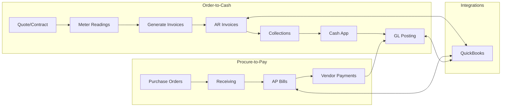

## Finance audit and Lean/Six Sigma UX flow (Printyx)

### Purpose and scope

- Map current finance capabilities (Order-to-Cash and Procure-to-Pay)
- Identify inconsistencies and missing links across AR/AP, invoices, payments, GL, forecasting, and QuickBooks
- Propose a target UX, a unified data model, and concrete API fixes aligned to Lean/Six Sigma

### Current state (as‑is) modules

- Accounts Receivable UI: `client/src/pages/AccountsReceivable.tsx`
  - Endpoints: GET/POST/PATCH `/api/accounts-receivable`, `/api/customers`
  - Creates invoices with amounts and terms; client computes balance initially
- Accounts Payable UI: `client/src/pages/AccountsPayable.tsx`
  - Endpoints: GET/POST/PATCH `/api/accounts-payable`, `/api/vendors`
  - Creates bills; client computes balance initially
- Invoices (contract billing): `client/src/pages/Invoices.tsx`
  - Endpoints: GET `/api/invoices`, POST `/api/invoices/generate`, PATCH `/api/invoices/:id`
  - Contract-aware invoice generation from meter periods
- Meter Billing: `client/src/pages/MeterBilling.tsx`
  - Endpoints: GET `/api/meter-readings|/api/equipment|/api/contracts|/api/contract-tiered-rates|/api/invoices`, POST `/api/billing/generate-invoices` (note: different from `/api/invoices/generate`), POST `/api/meter-readings`, POST `/api/contract-tiered-rates`
- Billing hub (summary): `client/src/pages/billing.tsx`
- Chart of Accounts: `client/src/pages/ChartOfAccounts.tsx`
  - Endpoints: GET/POST/PATCH/DELETE `/api/chart-of-accounts`
- Journal Entries: `client/src/pages/JournalEntries.tsx`
  - Endpoints: GET/POST/PATCH/DELETE `/api/journal-entries`
- Customer Financials rollup: `client/src/components/customer/CustomerFinancials.tsx`
  - Endpoints: `/api/customers/:id/financial-summary|/payments|/aging|/contracts`
- Customer Invoices list: `client/src/components/customer/CustomerInvoices.tsx`
  - Endpoint: GET `/api/customers/:id/invoices`
- Financial Forecasting: `client/src/pages/FinancialForecasting.tsx`
  - Endpoints: `/api/financial/metrics|/forecasts|/cash-flow|/profitability|/kpis` (+ POSTs)
- QuickBooks Integration: `client/src/pages/QuickBooksIntegration.tsx`, server `server/routes-quickbooks-integration.ts`, mappings `shared/quickbooks-schema.ts`, `server/quickbooks-mapping.ts`
  - OAuth connect/disconnect/status
  - Syncs Customers/Items; creates Customer; supported entities list

### As‑is flow (high level)

### Issues and inconsistencies (top defects)

1. Invoice generation endpoints inconsistent

   - `Invoices.tsx` uses POST `/api/invoices/generate`; `MeterBilling.tsx` uses POST `/api/billing/generate-invoices`.
   - Recommendation: standardize on POST `/api/invoices/generate` with optional `source=meter` param; keep `/api/billing/generate-invoices` as deprecated alias.

2. Missing server routes for several UIs

   - AR/AP: `/api/accounts-receivable`, `/api/accounts-payable`
   - COA/JE: `/api/chart-of-accounts`, `/api/journal-entries`
   - Customer rollups: `/api/customers/:id/financial-summary|/payments|/aging|/invoices`
   - Implement tenant-scoped CRUD with validation and status transitions.

3. Status and field naming drift across modules

   - AR statuses: `pending|sent|partial|paid|overdue` vs CustomerInvoices statuses: `open|partial|paid|overdue|void`.
   - Recommendation: unify invoice status enum: `draft|sent|partial|paid|overdue|void|cancelled`.

4. Payments/cash application missing

   - No `/api/payments` to apply payments to invoices, compute balances, and post to GL.
   - Add auto-apply rules and remittance processing; expose on AR UI and customer views.

5. GL control and period close

   - JE UI enforces debits=credits (good) but lacks posting states, period locks, and reversal workflow.
   - Add `posted_at`, `period_id`, close/reopen controls; disallow edits/deletes when posted or period closed.

6. QuickBooks integration scope gaps

   - Sync for Invoices, Bills, Payments not implemented; only Customers/Items.
   - Add push/pull for Invoices/Bills/Payments, plus webhook handlers for updates.

7. Contract billing cohesion
   - MeterBilling computes and generates invoices; ensure same invoice objects feed AR and Customer views with consistent fields.

### Target state (to‑be) UX and data flow

Principles

- One invoice model across manual AR and contract/meter billing
- One payments engine (cash app) with rules, audit, and GL posting
- Clear status transitions and period control; tenant-scoped RBAC everywhere
- QuickBooks as external ledger sync, not the internal source of truth

Target UX journey

1. Accounts Receivable

   - Unified invoice list (filters: status, customer, contract)
   - Actions: Send, Record Payment, Write-off, Void, Refund
   - Customer 360: Financial summary, aging, payments, contracts, invoices

2. Meter/Contract Billing

   - Generate invoices (period selection, preview, exceptions)
   - Post to AR with proper terms and due dates

3. Accounts Payable

   - Bills intake (manual/import/QB)
   - Approvals, payment runs, vendor aging

4. GL & Controls

   - Chart of Accounts management and JE posting/period close
   - Auto-posting templates for AR/AP events; reversal entries

5. QuickBooks Integration
   - Guided connect; selective sync of Customers, Items, Invoices, Bills, Payments
   - Sync status dashboard; conflict resolution

Low‑fidelity UI cues

- AR cards/table with inline `Record Payment` and `Send Invoice`
- CustomerFinancials shows DSO, aging bars, last payment; one-click `Record Payment`
- JE form disables edit/delete when `status=posted` or `period.closed=true`
- MeterBilling `Generate Invoices` button calls unified `/api/invoices/generate`

### Lean/Six Sigma framing

SIPOC (O2C and P2P)

- Suppliers: Sales/Contracts, Meter data, Vendors, Bank feeds, QuickBooks
- Inputs: Contracts, meter reads, costs, terms, COA, vendor bills
- Process: Rate/calc → Generate invoices → Send/collect → Apply cash → Post to GL
- Outputs: Paid invoices, accurate ledgers, aging, KPIs
- Customers: Finance, Exec, Sales, Vendors

Value stream metrics (core KPIs)

- DSO, CEI (collection effectiveness index)
- Invoice cycle time, First-pass yield (FPY) for invoices
- % e-payments vs checks, Payment application accuracy
- DPO, AP cycle time, Early-pay discounts captured
- Close time, JE correction rate, Period reopen rate

Waste identification

- Overprocessing: duplicate invoice endpoints; manual balance calculations in client
- Waiting: manual cash application; no bulk send or auto-apply
- Motion: switching modules for customer financials; unify actions on Customer 360
- Defects: inconsistent status enums; unposted GL; missing tenant/RBAC guards

Poka‑yoke

- JE debits=credits enforced (present); also enforce no edit after posted
- Prevent payment posting that causes negative balance
- Validate invoice status transitions (cannot pay a voided invoice)
- Period close prevents new postings; require reversal entries

Control plan

- Dashboards: DSO/DPO, aging buckets, close time, FPY
- Alerts: invoices approaching overdue, unapplied cash, period close blockers

### Concrete code & API recommendations

Unify and implement endpoints (tenant-scoped, RBAC‑guarded)

- Invoices

  - GET/POST `/api/invoices`
  - POST `/api/invoices/generate` { source: 'meter'|'manual', contractId?, periodStart?, periodEnd? }
  - PATCH `/api/invoices/:id` (status transitions: draft→sent→partial/paid; →overdue by scheduler; →void)
  - GET `/api/customers/:id/invoices`

- Payments (cash application)

  - GET/POST `/api/payments` (payment, method, amount, remittance)
  - POST `/api/payments/apply` { paymentId, allocations: [{ invoiceId, amount }] }
  - Auto-apply endpoint: POST `/api/payments/auto-apply` { customerId, paymentId }

- Accounts Receivable / Payable

  - GET/POST/PATCH `/api/accounts-receivable`
  - GET/POST/PATCH `/api/accounts-payable`
  - Aging: GET `/api/customers/:id/aging` and tenant-level `/api/finance/ar/aging`

- Meter Billing

  - Replace POST `/api/billing/generate-invoices` with `/api/invoices/generate`; keep alias temporarily

- Chart of Accounts & Journal Entries

  - GET/POST/PATCH/DELETE `/api/chart-of-accounts`
  - GET/POST/PATCH/DELETE `/api/journal-entries`; enforce posting rules (`posted_at`, `period_id`)
  - Period control: `/api/gl/periods` (open/close)

- Customer Financials aggregations

  - GET `/api/customers/:id/financial-summary|/payments|/contracts` (compose from AR/AP/Invoices/Contracts)

- QuickBooks integration (extend)
  - Sync invoices: POST `/api/quickbooks/sync/invoices`
  - Sync bills: POST `/api/quickbooks/sync/bills`
  - Sync payments: POST `/api/quickbooks/sync/payments`
  - Push single entities: POST `/api/quickbooks/push/invoice|bill|payment`
  - Webhook: handle invoice/bill/payment updates to keep status in sync

Data model harmonization

- Invoice status enum: `draft|sent|partial|paid|overdue|void|cancelled`
- Monetary fields numeric/decimal server-side; client never computes authoritative balances
- Payment entity with allocations; recompute `paidAmount`/`balanceAmount` on server

RBAC/tenancy

- Restrict JE posting/period close to finance roles; enforce tenantId on all queries

### Phased rollout plan

Phase 0 (quick wins)

- Standardize invoice generation endpoint; update MeterBilling to use `/api/invoices/generate`
- Add unified invoice status enum mapping in client components (AR, CustomerInvoices, Invoices)
- Implement `/api/customers/:id/financial-summary|/aging|/invoices` read endpoints

Phase 1 (structure)

- Implement `/api/accounts-receivable` and `/api/accounts-payable` CRUD with server-side balance/status rules
- Implement `/api/payments` + `/apply` with allocation logic and idempotency
- Implement `/api/chart-of-accounts` and `/api/journal-entries` with posting/locking

Phase 2 (integration)

- Extend QuickBooks routes to sync/push Invoices, Bills, Payments; add webhook handler
- Add AR/AP schedulers: overdue detection, dunning levels

Phase 3 (controls & analytics)

- GL periods open/close, posting journals for AR/AP events
- DSO/DPO dashboards, CEI, close time; improve FinancialForecasting inputs from real AR/AP

### Backlog (tracked work items)

- [ ] Replace `/api/billing/generate-invoices` usage with `/api/invoices/generate`
- [ ] Implement AR/AP server routes with tenant/RBAC guards
- [ ] Implement Payments + Auto-apply and link to AR balances
- [ ] Implement Customer Financials aggregations endpoints
- [ ] Implement COA/JE routes with posting/period lock
- [ ] Extend QuickBooks sync for invoices/bills/payments + webhooks
- [ ] Unify invoice status enums across UI components
- [ ] Add dunning tiers and email templates for collections
- [ ] Add bank import (CSV) for payments; reconcile to invoices

### Appendix: key hotspots

- AR: `client/src/pages/AccountsReceivable.tsx`
- AP: `client/src/pages/AccountsPayable.tsx`
- Invoices: `client/src/pages/Invoices.tsx`
- Meter Billing: `client/src/pages/MeterBilling.tsx`
- Customer Financials: `client/src/components/customer/CustomerFinancials.tsx`
- Customer Invoices: `client/src/components/customer/CustomerInvoices.tsx`
- COA: `client/src/pages/ChartOfAccounts.tsx`
- Journal Entries: `client/src/pages/JournalEntries.tsx`
- QuickBooks: `client/src/pages/QuickBooksIntegration.tsx`, `server/routes-quickbooks-integration.ts`, `server/quickbooks-mapping.ts`, `shared/quickbooks-schema.ts`
