## End-to-End Copier Dealer Lean/Six Sigma Playbook (Printyx)

### Purpose
- Provide a single, connected storyline from marketing lead → sales → order → warehouse build → delivery/installation → onboarding → service lifecycle → billing/renewal.
- Identify bottlenecks, standardize "Next" actions, forms/pages, KPIs, and quality gates using Lean/Six Sigma.
- Cross-reference existing Printyx artifacts to avoid duplication and align implementation.

### Key Cross-References
- COPIER_DEALER_A2Z_ROADMAP.md
- CRM_AUDIT_AND_LEAN_FLOW.md
- SERVICE_AUDIT_AND_LEAN_FLOW.md
- COMPREHENSIVE_ONBOARDING_CHECKLIST_SYSTEM.md
- ENHANCED_ONBOARDING_CHECKLIST_IMPLEMENTATION.md
- ADVANCED_PROPOSAL_BUILDER.md, PROPOSAL_BUILDER_DESIGN.md, PROPOSAL_BUILDER_INTEGRATION.md
- REPORTS_BLUEPRINT_AND_LEAN_KPIS.md, PRD.md

---

## Value Stream Overview

```mermaid
flowchart LR
  A[Lead Intake] --> B[Qualification]
  B --> C[Deal & Activities]
  C --> D[Quote]
  D --> E[Proposal]
  E --> F[Contract & eSign]
  F --> G[Order Entry]
  G --> H[Purchase Order / Vendor ETA]
  H --> I[Warehouse Kitting & Build]
  I --> J[Delivery Scheduling]
  J --> K[Installation & Training]
  K --> L[Onboarding Checklist]
  L --> M[Monitoring: Meters/Toner]
  M --> N[Service Intake & Dispatch]
  N --> O[Resolution & QA]
  O --> P[Billing & Contract Profitability]
  P --> Q[Renewal / Expansion]
```

---

## SIPOC Snapshots

### Sales Funnel (Lead → Close)
- Suppliers: Marketing, SDRs, Web forms, Data providers
- Inputs: Lead/contact data, product/pricing, availability
- Process: Qualify → Deal → Activities → Quote → Proposal → Close
- Outputs: Closed-won, signed contract, booked order
- Customers: Sales, Finance, Operations

### Fulfillment/Install (Order → Go-Live)
- Suppliers: Vendors, Warehouse, Dispatch
- Inputs: Order, accessories list, site readiness
- Process: PO → Kitting → Schedule → Install → Train → Onboarding
- Outputs: Installed devices, trained users, configured network
- Customers: Customer stakeholders, Support, Billing

### Service Lifecycle (Ops → Support)
- Suppliers: Monitoring, Customer
- Inputs: Alerts, meter reads, service requests
- Process: Intake → Dispatch → Field work → Parts → Resolve → CSAT
- Outputs: Restored service, billed work, feedback
- Customers: Customer, Finance, Operations

---

## Step-by-Step Flow with "Next" Actions and Pages

Notes: Routes referenced from `client/src/App.tsx` and navigation from `client/src/components/layout/role-based-sidebar.tsx`.

1) Lead Intake
- Page: `/leads-management` (Sales & CRM → Leads Management)
- Key forms: Lead create/edit; data enrichment
- Default next: "Create Deal" → `/deals-management`
- KPIs: Time-to-first-touch, lead quality score, conversion rate to qualified
- Quality gate: Required contact info, source, segment
- Common wastes: Duplicate entry; fix with enrichment/validation

2) Qualification & Deal Setup
- Page: `/deals-management`, Lead Detail page (`LeadDetail`)
- Default next: "Create Quote" → `/quotes/new?leadId=...`
- KPIs: Stage cycle time, SQL rate, scheduled activities per deal
- Error-proofing: Stage guards (cannot quote without contact + value)
  - Ref: CRM_AUDIT_AND_LEAN_FLOW.md (stage guards, Poka‑yoke)

3) Activity Plan & Demo Scheduling
- Page: `/demo-scheduling`, CRM activity views (`CRMEnhanced`)
- Default next: "Generate Quote" → `/quotes/new?dealId=...`
- KPIs: No-show %, time-to-demo
- Quality gate: Meeting outcome logged before moving stage

4) Quote Creation
- Page: `/quotes/new` and `/quotes/:quoteId`
- Default next: "Create Proposal" → `/proposal-builder?quoteId=...`
- KPIs: Lead time to quote, discount level vs target margin
- Error-proofing: Prefill company/contact; approval thresholds on discounts
- Ref: PROPOSAL_BUILDER_INTEGRATION.md (Create Proposal entry points)

5) Proposal Build & Delivery
- Page: `/proposal-builder`
- Default next: "Send for eSign" → `/contracts?proposalId=...`
- KPIs: Proposal acceptance rate/time, content reuse % (templates)
- Quality gate: Required sections complete; brand profile applied
- Ref: ADVANCED_PROPOSAL_BUILDER.md, PROPOSAL_BUILDER_DESIGN.md

6) Contract Generation & eSignature
- Page: `/contracts`, `/document-builder`, `/e-signature-integration`
- Default next: "Book Order" → `/orders/new?contractId=...`
- KPIs: Time-to-signature, redlines count, approval SLA compliance
- Error-proofing: Clause library, template locking, signer roles

7) Order Entry
- Page: `/orders` (if dedicated), else via `/contracts` → "Create Order"
- Default next: "Create Purchase Order" → `/admin/purchase-orders`
- KPIs: Order accuracy, rework %, cycle time to PO
- Quality gate: Device/accessory list complete; ship-to confirmed

8) Purchase Order & Vendor ETA
- Page: `/admin/purchase-orders`, `/vendor-management`
- Default next: "Release to Warehouse" → `/warehouse-operations`
- KPIs: PO lead time vs planned, backorder rate
- Error-proofing: Approved vendor catalog; substitutions workflow

9) Warehouse Kitting & Build
- Page: `/warehouse-operations`, `/equipment-lifecycle`
- Default next: "Schedule Delivery" → `/onboarding-dashboard` or scheduler
- KPIs: Build FPY (first-pass yield), kit completeness, WIP aging
- Quality gate: Accessory checklist, firmware levels, asset tags

10) Delivery Scheduling
- Page: `/onboarding-dashboard` (or dedicated scheduling)
- Default next: "Start Install" → `/enhanced-onboarding-form` or `/comprehensive-onboarding-form`
- KPIs: On-time arrivals, customer readiness pass rate
- Error-proofing: Pre‑install checklist auto-sent to customer

11) Installation & Training
- Page: `EnhancedOnboardingForm` (`/enhanced-onboarding-form`), `ComprehensiveOnboardingForm` (`/comprehensive-onboarding-form`)
- Default next: "Complete Onboarding" → `/onboarding-details/:id` then "Go-Live"
- KPIs: Install duration vs plan, training completion rate
- Ref: COMPREHENSIVE_ONBOARDING_CHECKLIST_SYSTEM.md; ENHANCED_ONBOARDING_CHECKLIST_IMPLEMENTATION.md

12) Go‑Live & Handover
- Page: `/customer-success-management`
- Default next: "Enable Monitoring" → `/remote-monitoring` or manufacturer integration
- KPIs: FPY, early ticket rate (<30 days), CSAT
- Quality gate: Customer sign‑off captured; docs uploaded

13) Monitoring: Meters & Toner
- Page: `/meter-readings`, `/remote-monitoring`, manufacturer integration pages
- Default next: "Auto‑bill" → `/advanced-billing`
- KPIs: Meter compliance %, auto‑toner success %, missed meters
- Error-proofing: Auto reminders; integration health checks

14) Service Intake & Dispatch
- Pages: `/service-hub`, `PhoneInTicketCreator`, `TechnicianTicketWorkflow`
- Default next: "Dispatch" → Technician app; then "Complete & Bill"
- KPIs: Response/resolve time (SLA), FTF%, backlog aging
- Known gaps: SERVICE_AUDIT_AND_LEAN_FLOW.md notes missing endpoints for phone‑in and sessions; implement to close loop

15) Resolution, QA & Billing
- Page: `/service-analytics`, `/advanced-billing`
- Default next: "CSAT Survey" → capture and log; then "Report KPIs"
- KPIs: MTTR, parts usage, invoice cycle time, DSO
- Quality gate: Photos, signatures, parts reconciled; invoice status

16) Renewal / Expansion
- Page: `/customer-success-management`, `/contracts`
- Default next: "Refresh Proposal" → `/proposal-builder?customerId=...`
- KPIs: Retention rate, upsell %, contract profitability trend
- Error-proofing: Lease expiry alerts, renewal playbooks

---

## Bottlenecks, Causes, and Countermeasures

- Marketing/Lead
  - Bottlenecks: Low-quality leads, slow first response
  - Fixes: SLA timers, lead scoring, enrichment, auto-routing

- Qualification
  - Bottlenecks: Duplicate entry; unclear stage definitions
  - Fixes: Stage guards, prefilled forms, required fields

- Quote/Proposal
  - Bottlenecks: Pricing exceptions, slow approvals
  - Fixes: Approval tiers, templates, discount guardrails

- Contract
  - Bottlenecks: Redlines; signer chase
  - Fixes: Clause library, signer reminders, role defaults

- Order/PO
  - Bottlenecks: Vendor delays, substitutions
  - Fixes: Alt SKUs, ETA tracking, proactive comms

- Warehouse Build
  - Bottlenecks: Missing accessories, rework
  - Fixes: Kitting checklist, FPY tracking, skill matrix

- Delivery/Install
  - Bottlenecks: Site not ready, network hurdles
  - Fixes: Pre‑install checklist, remote prep, standard configs

- Onboarding
  - Bottlenecks: Data gaps, missed steps
  - Fixes: Progressive forms, required photo/signature capture

- Monitoring/Meters
  - Bottlenecks: Missed reads, integration drift
  - Fixes: Health monitors, retries, customer portal reads

- Service
  - Bottlenecks: Missing endpoints, fragmented tickets
  - Fixes: Implement noted API routes; unify ticket model and metrics source

- Billing/Finance
  - Bottlenecks: Invoice delays, disputes, DSO
  - Fixes: Auto-bill on completion; contract profitability dashboards

---

## KPIs by Stage (targets align with REPORTS_BLUEPRINT_AND_LEAN_KPIS.md)

- Lead: response SLA (e.g., <15 min), MQL→SQL rate, data completeness
- Deal: stage cycle time, activity-to-meeting rate
- Quote: lead time to quote, price accuracy, approval SLA
- Proposal: acceptance rate/time, template reuse
- Contract: time-to-sign, redlines count
- Order/PO: PO lead time vs planned, backorder rate
- Warehouse: FPY, kit completeness, WIP aging
- Delivery: on-time %, customer readiness pass rate
- Install/Onboarding: duration vs plan, training completion
- Monitoring: meter compliance %, auto-toner success %
- Service: SLA on-time %, MTTR, FTF%, backlog aging, CSAT/NPS
- Billing: invoice cycle time, DSO, write-offs, contract profitability
- Renewal: retention %, upsell %, margin trend

---

## Quality Gates (Definition of Done) per Stage

- Quote DoD: Contact + value present; discount approvals complete
- Proposal DoD: Required sections complete; brand applied; preview ok
- Contract DoD: Correct parties/signers; terms template locked; eSign complete
- Order DoD: Device/accessory list complete; ship/bill addresses; tax
- Warehouse DoD: Checklist pass; asset tags; firmware; photos
- Install DoD: Network config applied; test prints; training sign-off
- Onboarding DoD: Checklist 100%; attachments; support contacts shared
- Service DoD: Steps completed; parts reconciled; signatures; invoice created

---

## Implementation Backlog (high-impact)

- Sales/CRM
  - Add "Next" buttons in `LeadDetail` and `/deals-management` to drive to `/quotes/new` (prefill context)
  - Enforce stage guards per CRM_AUDIT_AND_LEAN_FLOW.md

- Quote/Proposal
  - Already integrated: "Create Proposal" from Quotes (see PROPOSAL_BUILDER_INTEGRATION.md)
  - Add "Send for eSign" action in Proposal Builder header

- Contracts/Orders
  - From `/contracts`, add "Book Order" with validation and default PO creation
  - From `/admin/purchase-orders`, add "Release to Warehouse" CTA

- Warehouse/Delivery
  - Add kitting checklist form and FPY capture under `/warehouse-operations`
  - Delivery scheduler tied to customer availability; pre‑install email automation

- Installation/Onboarding
  - Use `EnhancedOnboardingForm`/`ComprehensiveOnboardingForm`; prefill from order/quote
  - Require photos, signatures, network config fields before completion

- Monitoring & Service
  - Implement missing service endpoints listed in SERVICE_AUDIT_AND_LEAN_FLOW.md
  - Unify phone-in → service ticket conversion and metrics source of truth

- Billing & Reporting
  - Auto-create invoice on service completion; route to `/advanced-billing`
  - Implement initial `/api/reports` per REPORTS_BLUEPRINT_AND_LEAN_KPIS.md

---

## Navigation Blueprint (Step → Route → Next)

- Leads → `/leads-management` → Next: Deals
- Deals → `/deals-management` or `LeadDetail` → Next: Quotes
- Quotes → `/quotes/new|:id` → Next: Proposal Builder
- Proposal → `/proposal-builder` → Next: Contracts/eSign
- Contracts → `/contracts` → Next: Orders/PO
- Purchase Orders → `/admin/purchase-orders` → Next: Warehouse Ops
- Warehouse → `/warehouse-operations` → Next: Delivery Scheduler
- Delivery → `/onboarding-dashboard` → Next: Install/Onboarding Forms
- Onboarding → `/enhanced-onboarding-form` or `/comprehensive-onboarding-form` → Next: Go‑Live
- Go‑Live → `/customer-success-management` → Next: Monitoring
- Monitoring/Meters → `/meter-readings` → Next: Billing/Alerts
- Service → `/service-hub` → Next: Complete & Bill
- Billing → `/advanced-billing` → Next: Reporting
- Reporting → `/reports` → Next: Manager/Exec scorecards

---

## Notes & Next Actions
- This is a living document; update as endpoints/pages are implemented.
- Prioritize closing the service API gaps and wiring "Next" actions.
- After wiring, enable dashboard tiles to surface SLA/DoD breaches per stage.

---

## Lean Governance & Cadence

- Daily: 15‑min standup by function (Sales, Ops, Service, Finance) with 1 KPI and 1 blocker each.
- Weekly Ops Review: Cross‑functional review of flow metrics and top 3 bottlenecks; commit next kaizen items.
- Monthly Kaizen: Standard work updates, policy changes, retrospective on flow time improvements.
- Owners: assign per section below; keep RACI up to date.

## Control Plan & Visual Management

- Control charts and tiles (target vs actual) on role dashboards for:
  - Sales: response SLA, lead→quote time, proposal acceptance rate
  - Fulfillment: PO lead time, warehouse FPY, delivery on‑time
  - Onboarding: install duration, training completion, early ticket rate (<30d)
  - Service: SLA on‑time %, MTTR, FTF%, backlog aging
  - Billing/Finance: invoice cycle time, DSO, dispute rate
- Breach tiles link to filtered lists (drill‑through) and show “Next” corrective action.

## Standard Work by Stage (SWI)

- Every stage must have:
  - Defined inputs/outputs, required artifacts, and a “Next” CTA validated in UI
  - Prefilled forms from prior stage context; no duplicate entry
  - DoD checks enforced in UI (see Quality Gates)
- Audit list (pass/fail):
  - Leads → Quotes prefill works from `/leads-management`
  - Quotes → Proposal Builder deep link with `?quoteId` works
  - Proposal → Contracts/eSign deep link present
  - Contracts → PO → Warehouse → Onboarding links present and tested
  - Onboarding → Customer Success → Meter Readings → Billing links present and tested
  - Service Hub → Advanced Billing `?ticketId` works

## SLAs & Targets (initial)

- Sales: response < 15 min; lead→quote < 3 days; proposal acceptance > 35%
- Fulfillment: PO lead time within vendor spec; warehouse FPY > 95%; delivery on‑time > 95%
- Onboarding: install duration within plan ±20%; training completion 100%
- Service: response on‑time > 90%; MTTR median < 8h; FTF% > 70%; backlog > 7 days = red
- Billing: invoice creation < 24h from completion; DSO < 35 days; disputes < 2%

## RACI Snapshot (high‑level)

- Sales funnel (Lead→Close): R = Sales; A = Sales Manager; C = Finance, Ops; I = Service
- Fulfillment (Order→Warehouse): R = Ops; A = Ops Manager; C = Sales, Vendors; I = Finance
- Delivery/Onboarding: R = Ops/Implementation; A = Ops Manager; C = Customer Success, Service; I = Sales
- Service lifecycle: R = Service; A = Service Manager; C = Parts/Warehouse; I = Finance
- Billing/Collections: R = Finance; A = Controller; C = Sales/Service; I = Exec

## Andon / Escalation Rules

- Auto‑escalate when:
  - Sales response SLA breach; proposal aging > target
  - PO lead time variance > 2× plan; backorder flagged without substitution
  - Warehouse FPY < 90% weekly; kitting checklist fails
  - Delivery not scheduled within 3 business days of PO approval
  - Service SLA breach; ticket aging > 5 days; repeat tickets within 14 days
  - Meter reads missing N cycles; integration health fails
- Each escalation posts to the owner’s queue and manager summary tile.

## Data Quality & Single Source of Truth (SSOT)

- `business_records` as the customer SSOT; quotes/proposals reference it; contacts unified
- Quote ⇆ Proposal fields normalized; one set of pricing calculations
- Tickets unified: phone‑in converts to service ticket with shared metrics source
- Tenancy/RBAC enforced on all reports and API queries by `tenantId`

## Kaizen Backlog (prioritized)

- P1: Implement missing Service API endpoints noted in `SERVICE_AUDIT_AND_LEAN_FLOW.md` (Intake, Sessions, Steps)
- P1: Add DoD guards across UI forms to enforce Quality Gates before advancing
- P1: Role dashboards—add breach tiles with drill‑through filters per Control Plan
- P2: Warehouse kitting checklist + FPY capture in `/warehouse-operations`
- P2: Auto‑create invoice on service completion; route to `/advanced-billing?ticketId=...`
- P2: Meter billing schedules and alerts; resolve missed reads automatically
- P3: Renewal playbook alerts (lease expiry); auto‑generate “Refresh Proposal” links

---

## DoD Checklists & UI Enforcement (by stage)

- Leads
  - Required: `companyName`, `primary contact (name/email/phone)`, `leadSource`
  - UI: Disable “Create Quote” until required fields present; show inline checklist banner
  - Drill‑through: `/quotes/new?leadId={leadId}` when satisfied

- Quotes
  - Required: linked `businessRecordId`, at least 1 line item, pricing totals calculated
  - UI: Disable “Create Proposal” until satisfied; banner shows missing pieces
  - Drill‑through: `/proposal-builder?quoteId={quoteId}`

- Proposal
  - Required: Required sections present (`cover_page`, `pricing`), brand profile applied
  - UI: Enable “Send for eSign” only when required sections complete
  - Drill‑through: `/contracts?proposalId={proposalId}`

- Contracts
  - Required: `customerId`, dates, rates, eSign packet prepared
  - UI: “Book Order” enabled once eSign complete
  - Drill‑through: `/admin/purchase-orders?contractId={contractId}`

- Purchase Orders
  - Required: vendor selected, items present, totals > 0, status `approved`
  - UI: “Release to Warehouse” shown only when `status=approved`
  - Drill‑through: `/warehouse-operations?orderId={poId}`

- Warehouse / Delivery
  - Required: kitting checklist pass, asset tags, firmware levels
  - UI: “Start Install Checklist” enabled when checklist passes
  - Drill‑through: `/enhanced-onboarding-form?orderId={orderId}`

- Onboarding
  - Required: training complete, network config, customer sign‑off
  - UI: “Go‑Live & Handover” enabled then route to Customer Success
  - Drill‑through: `/customer-success-management`

- Service
  - Required: workflow steps complete, parts reconciled, photos/signature captured
  - UI: Show “Complete & Bill” → create invoice
  - Drill‑through: `/advanced-billing?ticketId={ticketId}`

- Billing
  - Required: invoice issued within 24h of completion
  - UI: Filter banner when landing with `ticketId|contractId`, with “Clear Filter”

---

## Breach Tiles & Drill‑Through Specs

- Sales response SLA breach
  - Tile: “Response SLA Breached (Last 24h)”
  - Drill‑through: `/leads-management?filter=sla_breach`

- Proposal aging
  - Tile: “Proposals Aging > 7 days”
  - Drill‑through: `/proposal-builder?filter=aging&days=7`

- PO lead time variance
  - Tile: “PO Variance > 2× Plan”
  - Drill‑through: `/admin/purchase-orders?filter=variance_gt_2x`

- Warehouse FPY < target
  - Tile: “Warehouse FPY < 95% (7d)”
  - Drill‑through: `/warehouse-operations?tab=build&filter=fpy_lt_95`

- Delivery not scheduled
  - Tile: “PO Approved > 3d without Delivery”
  - Drill‑through: `/warehouse-operations?tab=delivery&filter=unscheduled`

- Service SLA / backlog breach
  - Tile: “Service SLA Breach / Aging > 5d”
  - Drill‑through: `/service-hub?tab=active-tickets&filter=aging_gt_5`

- Meter reads missing
  - Tile: “Missed Meters (N cycles)”
  - Drill‑through: `/meter-readings?filter=missed_cycles&n=N`

- Billing cycle delay
  - Tile: “Invoices not issued within 24h”
  - Drill‑through: `/advanced-billing?filter=issuance_delay_gt_24h`

Note: Implement these as URL params and handle at page level to pre‑filter lists.

---

## KPI Definitions & Formulas (initial set)

- Response SLA (Sales): on‑time responses / total responses
- Lead→Quote time: median hours from lead created to first quote
- Proposal acceptance rate: accepted / sent
- PO lead time variance: actual lead time / planned lead time
- Warehouse FPY: passed at first attempt / total units processed
- Delivery on‑time: on‑time deliveries / total deliveries
- Install duration variance: actual / planned
- Early ticket rate: tickets in first 30 days post go‑live / installs
- Service SLA on‑time: on‑time tickets / total tickets
- MTTR: median hours from opened → resolved
- FTF%: tickets resolved without follow‑up / total tickets
- Backlog aging: median age of open tickets in days
- Invoice cycle time: hours from completion → invoice created
- DSO: (Accounts Receivable / Total Credit Sales) × days in period
- Dispute rate: disputed invoices / total invoices

Implementation notes:
- Prefer median over mean for cycle times; compute per tenant and overall.
- Define filters by period (day/week/month) and role (rep/tech/manager).

---

## Page Filter API Contract Map (v1)

- Proposal Builder `/proposal-builder`
  - `filter=aging&days=N` → show quotes older than N days

- Service Hub `/service-hub`
  - `tab=overview|phone-in|active-tickets|technician-view`
  - `filter=aging_gt_N` (active tickets)

- Meter Readings `/meter-readings`
  - `filter=missed_cycles&n=N` → devices missing N cycles

- Purchase Orders `/admin/purchase-orders`
  - `filter=variance_gt_2x` → PO lead time variance > 2× plan

- Advanced Billing `/advanced-billing`
  - `ticketId=...|contractId=...` → filter invoices
  - `filter=issuance_delay_gt_24h` → invoice issuance delay breaches

Client behavior:
- Show banner when filter active; provide “Clear Filter” button.
- Forward relevant params to backend list endpoints.

---

## Reports API Plan (lightweight metrics layer v0)

- GET `/api/reports` with params: `type`, `from`, `to`, `groupBy`, `interval`
  - Example: `/api/reports?type=service_sla&from=2025-01-01&to=2025-03-31&groupBy=queue,priority&interval=week`
- Response:
  - `{ meta: { dims, measures, filters }, rows: [...], totals: {...} }`
- Report types (initial):
  - `sales_pipeline`, `proposals_aging`, `po_variance`, `warehouse_fpy`, `service_sla`, `ticket_aging`, `meter_missed`, `invoice_issuance_delay`

---

## RBAC & Tenancy Enforcement (QA plan)

- All list and report endpoints require `tenantId`; role permissions mapped per route
- Tests:
  - Deny cross‑tenant data access
  - Restrict finance endpoints to finance roles
  - Service operations only for service roles/managers
  - Dashboard modules filtered by role

---

## Observability & Quality Gates Automation

- Instrument list/report endpoints with timing, error rate, and volume metrics
- Alerts:
  - 5xx error rate > 1% over 5m (critical)
  - P95 latency regression > 2× baseline (warning)
  - Report job failures > threshold
  - Event: DoD breach counts spike (tile‑level)

---

## Rollout & Change Management

- Phased enablement of CTAs and filters per area; feature flags where needed
- Release cadence: weekly; add change log summaries to dashboard
- Backout plan: toggle flags; revert to default navigation

---

## Training & SOP Mapping

- Create short SOPs per stage:
  - “From Lead to Quote”, “Quote to Proposal”, “Contracts & Booking”, “PO to Warehouse”, “Delivery to Onboarding”, “Service to Billing”, “Meters to Billing”
- Embed links to SOPs on page banners when filters/DoD are active

---

## Lean Maturity Roadmap

- Level 1: Wiring Next CTAs, filter drill‑throughs, DoD enforcement
- Level 2: KPIs on dashboards and breach tiles with auto‑escalations
- Level 3: Automated report schedules, anomaly detection hooks
- Level 4: Predictive insights (risk/renewal), closed‑loop improvements

---

## Backend Implementation Checklist (must-have to reach “all or nothing”)

- [ ] Service lifecycle (Intake → Dispatch → Field work → Completion)
  - [ ] Phone‑in tickets: `GET/POST /api/phone-in-tickets`, `POST /api/phone-in-tickets/:id/convert`
  - [ ] Search helpers: `/api/phone-tickets/search-companies`, `/api/phone-tickets/search-contacts/:companyId`, `/api/phone-tickets/equipment/:companyId`
  - [ ] Technician sessions: `POST/GET /api/technician-sessions`, `GET /api/technician-sessions/:sessionId/workflow-steps`, `POST /api/technician-sessions/:sessionId/complete-step`
  - [ ] Persist photos/signatures/parts usage; unify metrics source across phone‑in and service tickets

- [ ] Billing integration & auto‑invoice
  - [ ] On service completion, create invoice and link by `ticketId`
  - [ ] Advanced Billing: support `ticketId`/`contractId` filters in `/api/billing/invoices`
  - [ ] Invoice issuance delay detection (store completion and issuance timestamps; indexed)
  - [x] Filters implemented in `server/routes.ts` for `/api/billing/invoices` (`ticketId`, `contractId`, `filter=issuance_delay_gt_24h`)
  - [ ] DB: Ensure `billing_invoices` has `ticket_id`, `contract_id`, `issuance_delay_hours`, `business_record_id`, `status`, `created_at`
  - [ ] DB Indexes:
    - [ ] `CREATE INDEX IF NOT EXISTS idx_bi_tenant_created ON billing_invoices(tenant_id, created_at DESC);`
    - [ ] `CREATE INDEX IF NOT EXISTS idx_bi_tenant_contract ON billing_invoices(tenant_id, contract_id);`
    - [ ] `CREATE INDEX IF NOT EXISTS idx_bi_tenant_ticket ON billing_invoices(tenant_id, ticket_id);`

- [ ] Purchase Orders variance
  - [ ] Persist planned lead time and actual lead/receipt dates
  - [ ] `/api/purchase-orders?filter=variance_gt_2x` returns only variance > 2× plan
  - [x] Filter implemented in `server/routes.ts` for `/api/purchase-orders`
  - [ ] DB: Ensure `approved_date`, `expected_date`, `order_date` columns exist
  - [ ] DB Index:
    - [ ] `CREATE INDEX IF NOT EXISTS idx_po_tenant_dates ON purchase_orders(tenant_id, approved_date, expected_date, order_date);`

- [ ] Meter reads “missed cycles”
  - [ ] Persist meter cadence (per device/contract) and expected next‑read
  - [ ] `/api/meter-readings?filter=missed_cycles&n=N` returns devices missing N cycles
  - [x] Implemented in `server/routes.ts`: latest reading per equipment where `reading_date < NOW() - (30*N days)`
  - [ ] DB Indexes:
    - [ ] `CREATE INDEX IF NOT EXISTS idx_meter_readings_tenant_equipment_date ON meter_readings(tenant_id, equipment_id, reading_date DESC);`
    - [ ] `CREATE INDEX IF NOT EXISTS idx_meter_readings_tenant_date ON meter_readings(tenant_id, reading_date DESC);`
  - [ ] DB Fields confirm:
    - [ ] `bw_meter_reading`, `color_meter_reading`, `reading_date`, `collection_method`, `reading_notes`

- [ ] Proposal aging
  - [ ] `/api/proposals?filter=aging&days=N` (or equivalent) returns proposals older than N days (indexed by `createdAt`, status)
  - [x] Implemented in `server/routes-proposals.ts` supporting `filter=aging&days=N`
  - [ ] DB Indexes:
    - [ ] `CREATE INDEX IF NOT EXISTS idx_proposals_tenant_created ON proposals(tenant_id, created_at DESC);`
    - [ ] `CREATE INDEX IF NOT EXISTS idx_proposals_tenant_status ON proposals(tenant_id, status);`

- [ ] Warehouse kitting FPY
  - [ ] Persist kitting checklist results and FPY outcome per unit
  - [ ] Expose FPY query endpoints for tiles/reports

- [ ] Onboarding persistence & linkages
  - [ ] Ensure onboarding checklists write all required fields; link `orderId|quoteId|businessRecordId`
  - [ ] Expose checklist status for “Go‑Live” handoff queries

- [ ] DoD enforcement server‑side
  - [ ] Validate transitions: quote has items, proposal required sections complete, contract eSigned, PO approved, kitting checklist pass, onboarding complete
  - [ ] Block Next actions if unmet; return actionable error messages

- [ ] Reports API (v0) with RBAC/tenancy
  - [ ] `GET /api/reports` supports: `sales_pipeline`, `proposals_aging`, `po_variance`, `warehouse_fpy`, `service_sla`, `ticket_aging`, `meter_missed`, `invoice_issuance_delay`
  - [ ] Response: `{ meta: {dims, measures, filters}, rows: [...], totals: {...} }`
  - [ ] All queries scoped by `tenantId`; role checks per report type

- [ ] Tests & Observability
  - [ ] Route and unit tests for each new endpoint; RBAC/tenancy tests
  - [ ] Emit timing/error metrics; alerts for error rate, P95 regressions, job failures
