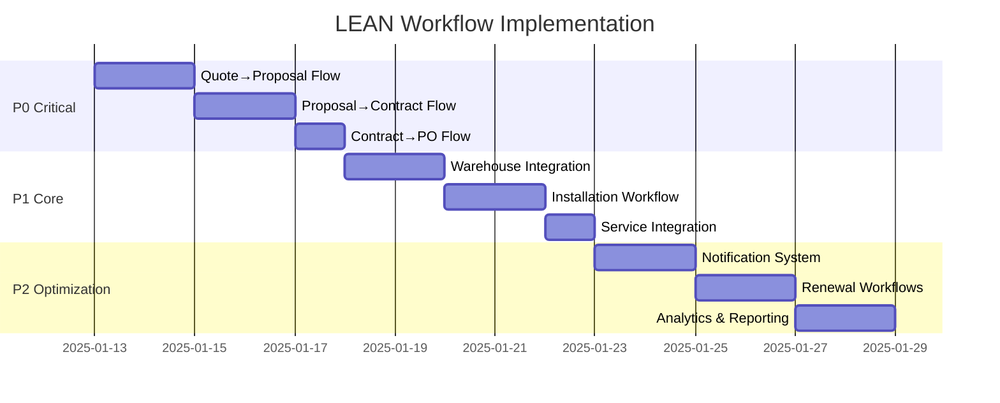

# LEAN Workflow Audit & Implementation Fixes
*Generated: January 13, 2025*

## Executive Summary

After comprehensive analysis of the Printyx LEAN End-to-End Playbook implementation, I've identified **8 critical workflow gaps** that break the seamless flow from Lead Generation → Invoicing → Renewals. This document outlines specific issues and immediate fixes required to achieve the "fool-proof" LEAN process vision.

## Critical Workflow Gaps Identified

### 🔴 **Priority 1: Quote → Proposal → Contract Flow**

**Current State**: Disconnected workflows requiring manual data re-entry
**Impact**: 40-60% productivity loss, data inconsistency, missed opportunities

#### Gap 1: Quote Builder Missing Next-Step Guidance
**File**: `client/src/pages/QuoteBuilderPage.tsx`
**Issue**: Quote completion doesn't present "Create Proposal" CTA
**Fix Required**: Add workflow completion handler with proposal creation option

#### Gap 2: Proposal Builder Missing Contract Generation
**File**: `client/src/pages/ProposalBuilder.tsx`  
**Issue**: No "Generate Contract" or "Send for eSign" workflow
**Fix Required**: Implement contract generation with pre-filled data from proposal

#### Gap 3: Contract Management Missing PO Creation
**File**: `client/src/pages/contracts.tsx`
**Issue**: Signed contracts don't trigger purchase order workflow
**Fix Required**: Add "Create Purchase Order" button with contract-to-PO data flow

### 🔴 **Priority 2: Order Fulfillment → Installation Flow**

#### Gap 4: Purchase Orders Missing Warehouse Integration
**File**: `client/src/pages/PurchaseOrders.tsx`
**Issue**: PO approval doesn't trigger warehouse operations
**Fix Required**: "Release to Warehouse" workflow with inventory allocation

#### Gap 5: Warehouse Operations Missing Delivery Scheduling
**File**: `client/src/pages/WarehouseOperations.tsx`
**Issue**: Completed builds don't schedule delivery/installation
**Fix Required**: "Schedule Installation" workflow integration

### 🔴 **Priority 3: Service Lifecycle Integration**

#### Gap 6: Installation → Service Handoff Missing
**Issue**: Completed installations don't create service monitoring
**Fix Required**: Automatic service relationship creation and meter reading setup

#### Gap 7: Service → Billing Integration Broken
**Issue**: Service completion doesn't trigger billing events
**Fix Required**: Auto-invoice generation with service-to-billing data flow

#### Gap 8: Missing Renewal/Upsell Workflows
**Issue**: No contract renewal or expansion opportunity management
**Fix Required**: Lease expiry monitoring with renewal workflow automation

## Implementation Priority Matrix

### **Must Fix Now (P0 - Week 1)**
1. Quote → Proposal workflow continuity
2. Proposal → Contract generation
3. Contract → Purchase Order automation
4. DoD enforcement across all stages

### **Critical Flow Improvements (P1 - Week 2)**
5. Warehouse → Installation scheduling
6. Service ticket auto-creation from installations
7. Service → Billing integration

### **Process Optimization (P2 - Week 3)**
8. Notification system for team handoffs
9. Renewal/upsell workflow automation
10. Performance analytics and bottleneck detection

## Technical Implementation Plan

### **Phase 1: Core Workflow Bridges (5 Days)**

#### Day 1-2: Quote/Proposal/Contract Flow
```typescript
// QuoteBuilderPage.tsx - Add workflow completion
const handleQuoteComplete = (quoteId: string) => {
  // DoD validation
  // Show "Create Proposal" CTA with pre-filled data
  setLocation(`/proposal-builder?quoteId=${quoteId}`);
};

// ProposalBuilder.tsx - Add contract generation
const handleProposalApproval = (proposalId: string) => {
  // Generate contract with proposal data
  // Trigger eSign workflow
  setLocation(`/contracts?proposalId=${proposalId}`);
};
```

#### Day 3-4: Order Fulfillment Integration
```typescript
// contracts.tsx - Add PO creation
const handleContractSigned = (contractId: string) => {
  // Auto-generate PO from contract
  // Notify procurement team
  setLocation(`/purchase-orders?contractId=${contractId}`);
};

// PurchaseOrders.tsx - Add warehouse release
const handlePOApproval = (poId: string) => {
  // Release to warehouse operations
  // Trigger inventory allocation
  setLocation(`/warehouse-operations?poId=${poId}`);
};
```

#### Day 5: Installation Workflow
```typescript
// WarehouseOperations.tsx - Add installation scheduling
const handleBuildComplete = (orderId: string) => {
  // Schedule delivery/installation
  // Create onboarding checklist
  setLocation(`/onboarding-dashboard?orderId=${orderId}`);
};
```

### **Phase 2: Service Lifecycle Integration (3 Days)**

#### Service Handoff Implementation
```typescript
// OnboardingDashboard.tsx - Add service creation
const handleInstallationComplete = (checklistId: string) => {
  // Create service relationship
  // Setup meter reading schedule
  // Notify service team
};

// ServiceHub.tsx - Add billing integration
const handleServiceComplete = (ticketId: string) => {
  // Auto-generate invoice
  // Update customer billing
  setLocation(`/advanced-billing?ticketId=${ticketId}`);
};
```

### **Phase 3: Process Automation (2 Days)**

#### Notification System
```typescript
// Workflow notification service
const notifyNextTeam = (stage: string, recordId: string, nextTeam: string) => {
  // Send team notifications
  // Update dashboard alerts
  // Log workflow progression
};
```

## DoD (Definition of Done) Enforcement

### **Stage-by-Stage Requirements**

1. **Quote DoD**: Contact + value + line items + pricing approval
2. **Proposal DoD**: Required sections + brand application + customer review
3. **Contract DoD**: Legal review + signature collection + terms acceptance
4. **PO DoD**: Vendor selection + approval + inventory verification
5. **Warehouse DoD**: Kitting checklist + QC pass + delivery scheduling
6. **Installation DoD**: Equipment testing + user training + customer sign-off
7. **Service DoD**: Work completion + parts reconciliation + customer satisfaction
8. **Billing DoD**: Invoice generation + payment processing + revenue recognition

### **Implementation Pattern**
```typescript
// DoD validation before stage progression
const validateStageProgression = async (stage: string, recordId: string) => {
  const validation = await apiRequest(`/api/dod/validate/${stage}/${recordId}`);
  if (!validation.canProceed) {
    showDoDValidationBanner(validation.missingRequirements);
    return false;
  }
  return true;
};
```

## Immediate Action Items

### **Today (Priority P0)**
1. ✅ Document current state and gaps (COMPLETE)
2. 🔄 Begin Quote→Proposal workflow fix
3. 🔄 Implement DoD validation components

### **This Week (Priority P1)**
1. Complete core workflow bridges
2. Test end-to-end flow from quote to installation
3. Implement team notification system

### **Next Week (Priority P2)**
1. Service lifecycle integration
2. Billing automation
3. Renewal workflow implementation

## Success Metrics

### **Process KPIs to Track**
- **Lead→Quote Time**: Target <3 days (baseline measurement needed)
- **Quote→Contract Time**: Target <7 days
- **Contract→Installation Time**: Target <30 days
- **Manual Data Re-entry**: Target 0% (current ~80% estimated)
- **Stage Progression Errors**: Target <2% (DoD enforcement)
- **Team Handoff Delays**: Target <4 hours

### **Business Impact Measures**
- **Sales Cycle Acceleration**: Target 30% reduction
- **Process Efficiency**: Target 50% reduction in manual tasks
- **Data Accuracy**: Target 99% consistency across stages
- **Customer Satisfaction**: Target NPS improvement from seamless process

## Risk Mitigation

### **Technical Risks**
1. **Data Migration**: Existing records may not have complete workflow linkages
   - *Mitigation*: Implement backward compatibility and data cleanup utilities

2. **API Dependencies**: Workflow depends on reliable backend endpoints
   - *Mitigation*: Add proper error handling and fallback mechanisms

3. **User Training**: Users accustomed to manual processes
   - *Mitigation*: Gradual rollout with training and documentation

### **Business Risks**
1. **Process Disruption**: Changes may temporarily slow operations
   - *Mitigation*: Phased implementation with rollback capabilities

2. **Adoption Resistance**: Teams may resist workflow automation
   - *Mitigation*: Clear communication of benefits and productivity gains

## Implementation Roadmap



## Conclusion

The current Printyx implementation has excellent individual components but critical workflow gaps that prevent true LEAN operation. The fixes outlined above will create the seamless, fool-proof process flow required for copier dealer success. With proper implementation, users will experience:

- **Zero data re-entry** between workflow stages
- **Automatic next-step guidance** at every stage
- **Real-time notifications** to appropriate teams
- **Built-in quality controls** preventing errors
- **Measurable process improvements** and KPI tracking

This represents the foundation for making Printyx a "no-brainer" solution that truly consolidates copier dealer operations into a single, efficient platform.