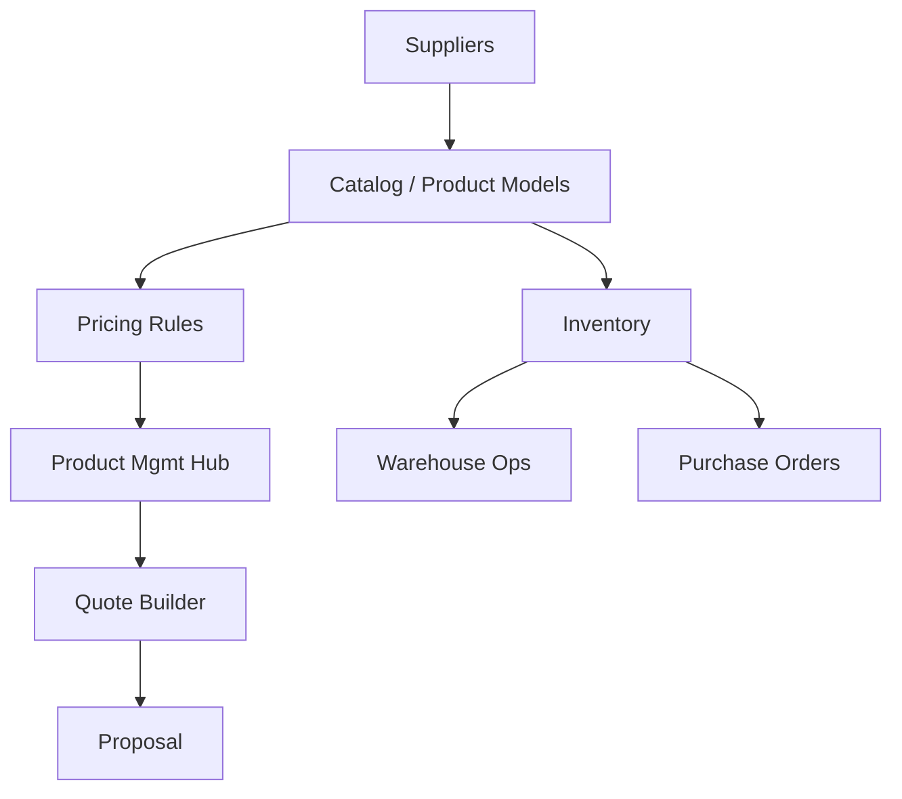

## Product Management audit and Lean/Six Sigma UX flow (Printyx)

### Purpose and scope

- Map current product/inventory/warehouse/pricing flows
- Identify defects and gaps; align to Lean principles (flow, pull, takt, quality)
- Recommend a target UX and endpoint plan with phased rollout

### Current state (as‑is) modules

- Product Management Hub (`client/src/pages/ProductManagementHub.tsx`): admin markup management; reads `/api/products/with-pricing`, `/api/pricing/company-settings`, `/api/pricing/products`; bulk update at `/api/pricing/products/bulk-update`
- Inventory (`client/src/pages/Inventory.tsx`): reads `/api/inventory`, shows stock/reorder status (UI only; missing actions wiring)
- Warehouse Operations (`client/src/pages/WarehouseOperations.tsx`): listed in routes; not opened here
- Purchase Orders (`client/src/pages/PurchaseOrders.tsx`): present; not opened here
- Product Models/Accessories/Service/Software Products: present as pages
- Server routes indicate pricing/warehouse/PO capability: `server/routes-pricing.ts`, `server/routes-warehouse.ts`, `server/routes-purchase-orders.ts` (not validated for UI parity)

### As‑is flow (high level)

### Issues and inconsistencies (top defects)

1. Pricing consistency and ownership

- UI writes pricing via `/api/pricing/products` but data source for `/api/products/with-pricing` is not shown; confirm single source of truth and tenant scoping.

2. Inventory actions missing

- `Inventory.tsx` shows items but no endpoints wired for “Update Stock”, “Reorder”, “Receive”.

3. Product taxonomy and models

- Product Models/Accessories pages exist; ensure consistent category and attribute schema across models, services, supplies.

4. Warehouse/PO integration gaps

- UI references exist; verify routes: `routes-warehouse.ts`, `routes-purchase-orders.ts`. Ensure receiving updates inventory and closes POs; add statuses.

5. Markup rules vs per‑product overrides

- Product Hub supports per‑product markup and company default; document precedence and expose preview in quote builder.

6. RBAC/tenancy enforcement

- Ensure pricing/product edits are tenant‑scoped and role‑gated (company admin only).

### Target state (to‑be) flow and UX

Principles

- One pricing brain; clear precedence (company default → category rules → product override)
- Inventory is system of record; PO receiving drives stock; quotes reference live pricing
- Pull signals for reordering; minimal clicks for common tasks

Target UX journey

1. Catalog
   - Unified Product Models with categories (equipment, accessories, services, software, supplies)
   - Attributes by category; search/SKU/model filters
2. Pricing
   - Company default markup; category rules; product overrides; preview on item
   - “Apply default markup to all without override” (already present)
3. Inventory
   - List with search and badges (low/med/good); quick actions: Update Stock, Reorder, Receive
4. Warehouse Ops
   - Transfers, bin locations, cycle counts; receiving ties to PO
5. Purchase Orders
   - Create PO from low‑stock items (pull); approve; receive → increment stock; partial receipts supported
6. Sales integration
   - Quote builder pulls product, applies pricing precedence and taxes; supply/service items supported

Low‑fidelity UI cues (additions)

- Inventory cards: inline “Reorder” (creates PO draft), “Receive” (opens receipt form), “Adjust” (stock correction)
- Product sidebar: show current pricing stack (default → category → override) and computed company price
- Quote builder: hover to see price breakdown (cost, markup, company price)

### Lean/Six Sigma framing

SIPOC (Product → Quote/Delivery)

- Supplier: Vendors, Manufacturers, Pricing data
- Inputs: Catalog, costs, markup rules, stock levels
- Process: Maintain catalog → Set pricing → Monitor inventory → Reorder/receive → Quote/sell
- Outputs: Accurate quotes, proper margins, correct inventory, POs, receipts
- Customers: Sales, Warehouse, Finance, Customer

Value stream metrics

- Quote price accuracy %, Gross margin %, Stockouts, Turns, Lead time to receive, PO cycle time, Inventory accuracy %, Cycle count variance

Waste identification

- Overprocessing: duplicate pricing rules/overrides; unclear precedence
- Waiting: manual reorder decisions; missing low‑stock to PO automation
- Motion: jumping across modules for stock updates; add inline actions
- Defects: mispriced items; stock not updated on receipts

Poka‑yoke

- Guardrails on minimum sale price; warn if price < floor
- Receiving requires PO match; prevent negative stock
- Category rule validation ranges

Control plan & KPIs

- Dashboards: margin attainment vs target, stockouts, aged stock, PO lead time, inventory accuracy

Standard work (examples)

- Weekly: review low‑stock report → auto‑generate PO drafts
- Monthly: margin review by category → adjust rules
- Daily: cycle count subset; reconcile variances

### Concrete code & API recommendations

Endpoints (confirm/implement)

- Products/Catalog

  - GET `/api/products/with-pricing` (tenant‑scoped)
  - GET/POST/PATCH `/api/products` (admin)
  - Category rules: GET/POST `/api/pricing/category-rules`

- Pricing

  - GET `/api/pricing/company-settings`
  - POST `/api/pricing/products` (set per‑product override)
  - POST `/api/pricing/products/bulk-update`

- Inventory

  - GET `/api/inventory`
  - POST `/api/inventory/adjust` (delta with reason)
  - POST `/api/inventory/reorder` (creates PO draft)
  - POST `/api/inventory/receive` (with PO line references; updates stock)

- Purchase Orders
  - GET/POST `/api/purchase-orders`, GET `/api/purchase-orders/:id`
  - POST `/api/purchase-orders/:id/receive` (partial/complete receipts)

RBAC/tenancy

- Pricing/product edits restricted to company admins; all endpoints require tenant context.

### Phased rollout plan

Phase 0 (quick wins – this week)

- Wire Inventory actions (Adjust/Reorder/Receive) to endpoints
- Show pricing precedence and live company price in Product Hub dialog

Phase 1 (structure – next 1–2 weeks)

- Category pricing rules CRUD and precedence engine
- Reorder: generate PO drafts from low‑stock items; PO list/detail

Phase 2 (integration – 2–4 weeks)

- Receiving updates inventory and closes PO lines; partial receipts
- Quote builder pulls category rules/overrides and displays price breakdown

Phase 3 (optimization – ongoing)

- Turns/aging dashboards; margin leakage detection; EOQ suggestions

### Backlog (tracked work items)

- [ ] Inventory: Adjust/Reorder/Receive endpoints + UI buttons
- [ ] Category pricing rules CRUD + precedence engine
- [ ] PO drafts from low‑stock; PO create/approve/receive
- [ ] Product pricing precedence display in Hub and Quote builder
- [ ] RBAC/tenancy coverage for all product/pricing endpoints
- [ ] Inventory accuracy & cycle count workflows

### Appendix: key hotspots

- Product Hub: `client/src/pages/ProductManagementHub.tsx`
- Inventory: `client/src/pages/Inventory.tsx`
- Server: `server/routes-pricing.ts`, `server/routes-warehouse.ts`, `server/routes-purchase-orders.ts`
