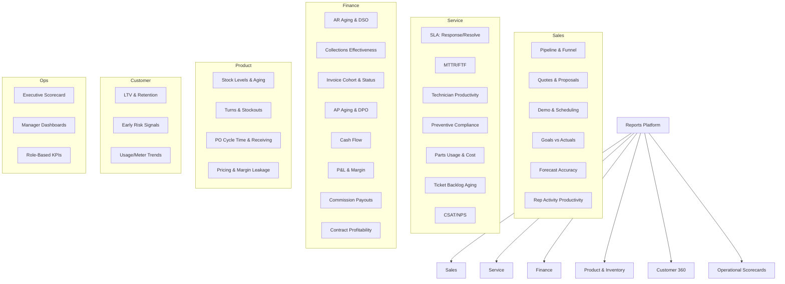

## Unified Reports blueprint and Lean KPIs (Printyx)

### Purpose

- Define a single reporting framework covering Sales, Service, Finance, and Product/Inventory
- Standardize KPIs, status enums, filters, and schedules; reduce duplicate logic and drift
- Provide an API plan, a report catalog, and a phased rollout aligned with Lean/Six Sigma

### Mind map (scope overview)

### Reporting framework (common design)

- Dimensions: time (day/week/month/quarter), tenant, location, rep/tech, customer, contract, product/category
- Measures: revenue, margin, counts, cycle times, rates (conversion, on-time), balances
- Filters: time range, status enums (unified), owner/teams, segment/tags
- Status alignment: use unified enums from CRM/Service/Finance docs (e.g., invoice: `draft|sent|partial|paid|overdue|void|cancelled`)
- Drill-through: summary → detail (e.g., AR bucket → invoice list → invoice)
- Scheduling: cron-like schedules persisted, email/PDF/CSV delivery, role/tenant scoped
- Exports: CSV, XLSX, PDF (table + chart snapshot)
- RBAC/tenancy: all queries scoped by `tenantId`; report access via role policies
- Quality gates: FPY for report jobs, data freshness SLA, unit tests on metric SQL

### Sales report catalog

- Pipeline & conversion funnel
  - Metrics: leads → SQL → opportunity → quote → proposal → closed-won rate; stage cycle times
  - Cuts: by rep, source, industry, location
- Quote & proposal performance
  - Quote aging, proposal acceptance rate/time, discount impact on win rate
  - Feed from `QuoteBuilder`/`Proposal` and deal statuses
- Demo & scheduling efficiency
  - No-show %, time-to-demo, demo-to-close cycle
  - Integrate from scheduling + CRM activities
- Goals vs actuals (targets)
  - Targets from `CRM Goals`; attainment %, variance; forecast vs actual
- Forecast accuracy
  - MAPE/WAPE by horizon (weekly/monthly), over/under bias
- Rep activity productivity
  - Activities per outcome, call/email-to-meeting conversion

### Service report catalog

- SLA performance
  - Response/resolve on-time %, breaches, breach reasons; by queue/priority/region
- MTTR and First-time-fix (FTF)
  - MTTR distribution; FTF%; repeats within N days
- Technician productivity
  - Jobs/day, travel vs work ratio, billable %, utilization, photos/signatures captured
- Preventive maintenance compliance
  - PM due vs completed on time, deferrals
- Parts usage & cost
  - Parts by ticket/type, cost recovery, returns
- Ticket backlog & aging
  - Backlog trend, age buckets, escalations
- Customer satisfaction
  - CSAT/NPS after completion; by tech/region

### Finance report catalog

- AR aging & DSO
  - Aging buckets by customer/segment; DSO trend; high-risk accounts
- Collections effectiveness (CEI)
  - Promise-to-pay kept %, collector performance
- Invoice cohort & status
  - Sent→paid lifecycle, partials, write-offs; meter-billing vs manual
- AP aging & DPO
  - Terms capture, early-pay discounts; vendor concentration
- Cash flow
  - Collections vs disbursements; operating cash metrics, days cash on hand
- P&L & margin
  - By product/service line, location; leakage analysis (discounts, overrides)
- Commission payouts
  - Payouts by plan/role; disputes and adjustments
- Contract profitability
  - Revenue vs cost (service cost, parts, time); margin trend per contract

### Product & Inventory report catalog

- Stock levels & aging
  - Obsolescence, dead stock, slow movers
- Turns & stockouts
  - Turns by category/location; stockout frequency/impact
- PO cycle time & receiving accuracy
  - Lead time actual vs planned; variance on receipts
- Pricing & margin leakage
  - Rule vs override usage; realized margins vs targets; quote price accuracy

### Customer 360 report catalog

- LTV, expansion/contraction by cohort
- Early risk signals: spike in tickets, aging AR, declining usage/meters
- Utilization trends by device/contract

### Operational scorecards (role-based)

- Executive: revenue, gross margin, DSO/DPO, SLA, FTF, pipeline, churn risk
- Sales Manager: pipeline health, forecast accuracy, rep productivity, goal attainment
- Service Manager: SLA/MTTR/FTF, backlog, PM compliance, parts cost
- Finance Manager: AR/AP aging, cash forecast, write-offs, close time

### Data sources and joins (at a glance)

- Sales: leads/opportunities, quotes, proposals, activities, scheduling, goals
- Service: tickets, technician sessions/steps, parts, PM schedules, CSAT
- Finance: invoices, payments, AR/AP, JE/COA, contracts, meter billing
- Product: inventory, POs, receiving, pricing rules/overrides

### Reports API plan (lightweight metrics layer)

- GET `/api/reports` with query params
  - Example: `/api/reports?type=sales_pipeline&from=2025-01-01&to=2025-03-31&groupBy=rep,stage&interval=month`
  - Response: `{ meta: {dims, measures, filters}, rows: [...], totals: {...} }`
- POST `/api/reports/export` { type, format: csv|xlsx|pdf, params }
- GET/POST `/api/report-schedules` (CRUD; cron, recipients, format, params)
- Security: all endpoints require tenant; RBAC checks per report type

Report type registry (examples)

- `sales_pipeline`, `sales_forecast_accuracy`, `quotes_aging`, `proposals_acceptance`
- `service_sla`, `service_mttr_ftf`, `service_backlog_aging`, `tech_productivity`
- `finance_ar_aging`, `finance_dso`, `finance_invoice_cohort`, `finance_ap_aging`, `finance_cashflow`, `finance_commissions`, `finance_contract_profitability`
- `inventory_turns`, `inventory_stockouts`, `po_cycle_time`, `pricing_leakage`

### Lean/Six Sigma alignment

- Voice of the customer: per-role scorecards, on-demand drill-through
- Waste reduction: one report engine; shared metrics registry; single enums
- Control: scheduled reports; FPY and freshness SLAs; anomaly alerts (e.g., spike in breaches/overdues)

### Phased rollout

- Phase 0: Framework & quick wins

  - Implement `/api/reports` wrapper with 3 report types: `sales_pipeline`, `service_sla`, `finance_ar_aging`
  - Add schedules/expor t stubs; wire `client/src/pages/reports.tsx` cards to params

- Phase 1: Depth by department

  - Sales: quotes/proposals aging, goals vs actuals, forecast accuracy
  - Service: MTTR/FTF, backlog aging, parts usage
  - Finance: DSO, invoice cohort, AP/DPO, commissions

- Phase 2: Product & Customer 360

  - Inventory turns/aging/stockouts, PO cycle; LTV and risk signals

- Phase 3: Executive/Manager scorecards and alerts
  - Cross-domain rollups; email/PDF schedules; anomaly detection hooks

### Backlog (actionable items)

- [ ] Create `/api/reports` with type registry and tenant/RBAC guard
- [ ] Add export service (CSV/XLSX/PDF) and `/api/report-schedules`
- [ ] Implement initial report SQL/adapters for: sales_pipeline, service_sla, finance_ar_aging
- [ ] Wire `reports.tsx` cards to params and add filter UI (date, owner, status)
- [ ] Define metrics glossary and enums in `shared/` for reuse
- [ ] Add unit tests for report adapters and FPY/freshness monitors
