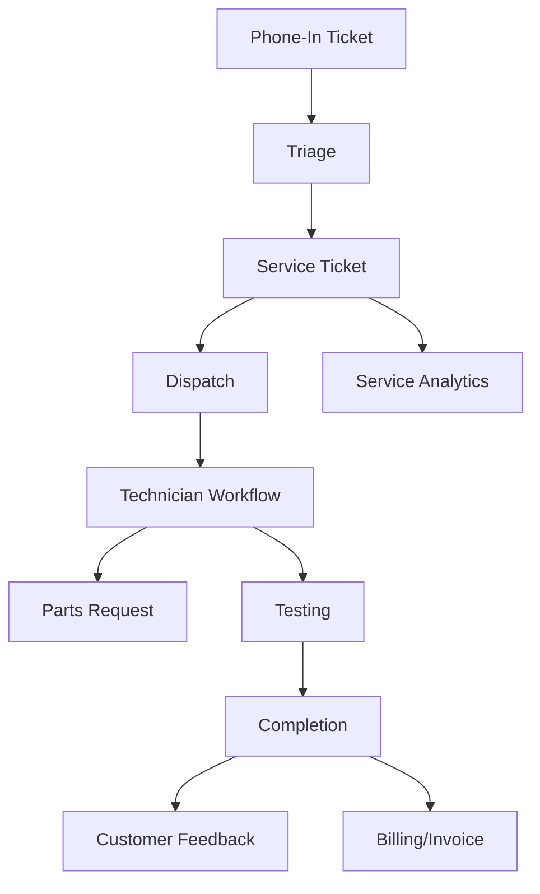

## Service audit and Lean/Six Sigma UX flow (Printyx)

### Purpose and scope

- Map current service capabilities (intake → dispatch → field work → completion)
- Identify defects, gaps, and wastes; propose code/API fixes
- Recommend a target LEAN flow and metrics with a phased rollout

### Current state (as‑is) flow

Observed implementation highlights

- ServiceHub with tabs for overview, phone‑in queue, active tickets, technician view (`client/src/pages/ServiceHub.tsx`)
- Guided intake wizard for phone‑in tickets (`PhoneInTicketCreator.tsx`)
- Technician workflow skeleton with step tracking (`TechnicianTicketWorkflow.tsx`)
- Dispatch/technician availability/analytics routes present (`server/routes-service-dispatch.ts`)
- Enhanced service schema for phone‑in tickets, technician sessions, workflow steps, and parts requests (`shared/enhanced-service-schema.ts`)

### Issues and inconsistencies (top defects)

1. Missing server endpoints used by UI (defect)

- UI calls:
  - `/api/phone-tickets/search-companies`, `/api/phone-tickets/search-contacts/:companyId`, `/api/phone-tickets/equipment/:companyId`
  - `/api/phone-in-tickets` (POST/GET) and `/api/phone-in-tickets/:id/convert`
  - `/api/technician-sessions`, `/api/technician-sessions/:sessionId/workflow-steps`, `/api/technician-sessions/:sessionId/complete-step`
- Only dispatch routes are implemented. Add the missing service routes to back the UI and the enhanced schema.

2. Ticket model fragmentation

- Phone‑in ticket separate from service ticket with partial “convert” flow; unify the conversion and ensure a single source for SLA/metrics.

3. SLA/metrics not enforced

- No response/repair SLAs, MTTR/MTTA tracking, or breach flags in UI.

4. Parts workflow not wired to inventory/vendors

- `ticket_parts_requests` exists; no endpoints/UI to request/approve/fulfill parts, nor inventory integration.

5. Technician session/location not integrated with mobile features

- GPS check‑in fields exist but no capture/verification; no photo/signature upload endpoints.

6. RBAC/tenancy consistency

- Ensure all new service routes use tenant-aware middleware and auth similar to dispatch routes.

### Target state (to‑be) flow and UX

Principles

- Intake once, flow forward; no duplicate data entry
- Ticket is the backbone; all actions (dispatch, parts, workflow) hang off ticket
- SLA timers visible; next‑best action and minimal clicks

Target UX journey

1. Intake (Phone, Portal, Monitoring)
   - Guided wizard (company → contact → location/equipment → issue/priority)
   - Create Phone‑In record → Convert or Auto‑create Service Ticket with SLA clock start
2. Triage
   - Auto‑categorize, suggest priority/SLA; attach knowledgebase suggestions
3. Dispatch
   - Technician recommendations (skills, proximity, load); assign/schedule
4. Field work (Technician)
   - Mobile: Check‑in (GPS), photos, diagnostics, parts request, customer approval/signature
5. Completion → Billing
   - Testing and close; auto‑generate service summary; push labor/parts to billing
6. Feedback and Analytics
   - CSAT capture; MTTR/First‑Time‑Fix; SLA attainment; utilization dashboards

Low‑fidelity UI cues (additions)

- ServiceHub: prominent “New Phone‑In” and “New Ticket” CTAs with SLAs and breach badges
- Ticket page: left (details/SLA clock), center (timeline/notes), right (next steps, parts, approvals)
- Technician app: one screen per step; offline‑capable photo/signature; big check‑in/out buttons

### Lean/Six Sigma framing

SIPOC (Service Request → Resolution)

- Supplier: Customer, Phone, Portal, Monitoring, Dispatch
- Inputs: Contact/company, equipment, issue, priority, technician capacity
- Process: Intake → Triage → Dispatch → Field work → Test → Complete → Bill
- Outputs: Resolved ticket, CSAT, invoice, parts consumption, analytics
- Customers: Customer, Service mgmt, Finance

Value stream metrics

- MTTA (time to acknowledge), MTTR (time to resolve), First‑Time‑Fix %, SLA attainment %, Truck rolls, Technician utilization %, Parts lead time

Waste identification

- Motion/Transport: duplicate data across phone‑in and ticket (unify conversion)
- Waiting: dispatch bottlenecks (auto recommendations, schedule slots)
- Overprocessing: manual parts approvals (rules)
- Defects: missing endpoints causing rework (implement and test routes)

Poka‑yoke

- Required fields by priority; GPS check‑in; photo requirement for certain categories; signature capture at completion

Control plan & KPIs

- Dashboards: SLA breach rate, MTTR trend (control chart), first‑time‑fix %, utilization
- Daily tier‑meet view with red/yellow/green on SLA stages

Standard work (examples)

- Intake: classify and set priority within 5 minutes; create ticket; set first ETA
- Dispatch: assign/schedule within SLA window; communicate ETA
- Technician: check‑in on arrival; log diagnosis; customer approval before work; check‑out with signature

### Concrete code & API recommendations

Service endpoints to implement (backing current UI)

- Phone‑in search & CRUD

  - GET `/api/phone-tickets/search-companies?q=...`
  - GET `/api/phone-tickets/search-contacts/:companyId?q=...`
  - GET `/api/phone-tickets/equipment/:companyId`
  - GET/POST `/api/phone-in-tickets`
  - POST `/api/phone-in-tickets/:id/convert` → creates `/api/service-tickets/:id`

- Technician sessions & workflow steps

  - GET `/api/technician-sessions?ticketId=...` (latest/open session)
  - POST `/api/service-tickets/:ticketId/check-in` (create session, store GPS)
  - GET `/api/technician-sessions/:sessionId/workflow-steps`
  - POST `/api/technician-sessions/:sessionId/complete-step`
  - POST `/api/technician-sessions/:sessionId/parts-requests`

- Service tickets (base)
  - GET `/api/service-tickets` (filters: status, priority, customer)
  - POST `/api/service-tickets` (direct create)
  - PATCH `/api/service-tickets/:id` (status, technician, schedule, SLA)

Tighten tenancy & auth

- Use the same pattern as dispatch routes; ensure all new endpoints resolve tenant and enforce RBAC.

Mobile & media

- Add upload endpoints for photos/signatures; store links on session/workflow step records.

Parts workflow

- CRUD for `/api/ticket-parts-requests`; approval rules (urgent/high bypass or notify), inventory/vendor integration hooks.

### Phased rollout plan

Phase 0 (quick wins – this week)

- Add server routes for phone‑in search and `/api/phone-in-tickets` used by `PhoneInTicketCreator`
- Implement `/api/service-tickets/:id/check-in` and session/step endpoints used by `TechnicianTicketWorkflow`
- Add SLA clocks and breach badges to ServiceHub cards (basic UI only)

Phase 1 (structure – next 1–2 weeks)

- Ticket page with timeline and right‑rail steps; unify phone‑in → ticket conversion and show lineage
- Dispatch recommendations integrated into ServiceHub (assign from list)
- Parts request UI + endpoints (create/approve/fulfill)

Phase 2 (integration – 2–4 weeks)

- Media capture/upload (photos, signature); GPS verification at check‑in
- Inventory/vendor integration for parts; push labor/parts to billing

Phase 3 (optimization – ongoing)

- Predictive dispatch (skills, distance, load); dynamic SLA buffers
- Control charts for MTTR/SLAs; First‑Time‑Fix drill‑downs

### Backlog (tracked work items)

- [ ] Implement phone‑in search + CRUD endpoints
- [ ] Implement technician sessions + workflow step endpoints
- [ ] Add Service Ticket base endpoints (list/create/update)
- [ ] SLA clocks and breach indicators in ServiceHub
- [ ] Ticket detail page (timeline, right‑rail steps)
- [ ] Parts request endpoints and UI; inventory/vendor hooks
- [ ] Media upload (photo/signature) endpoints and UI elements
- [ ] GPS verification at check‑in; store coordinates
- [ ] RBAC/tenancy audit across all service routes

### Risks and dependencies

- Mobile/offline constraints for technician app (decide scope)
- GPS/photo/signature privacy/storage policies
- Inventory/vendor connectors readiness

### Appendix: key hotspots

- ServiceHub UI: `client/src/pages/ServiceHub.tsx`
- Phone‑in wizard: `client/src/components/service/PhoneInTicketCreator.tsx`
- Technician workflow: `client/src/components/service/TechnicianTicketWorkflow.tsx`
- Dispatch routes (present): `server/routes-service-dispatch.ts`
- Enhanced service schema: `shared/enhanced-service-schema.ts`
